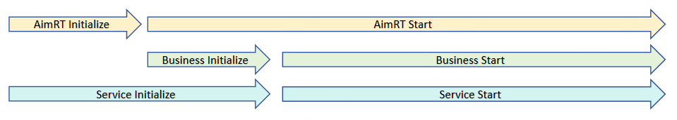
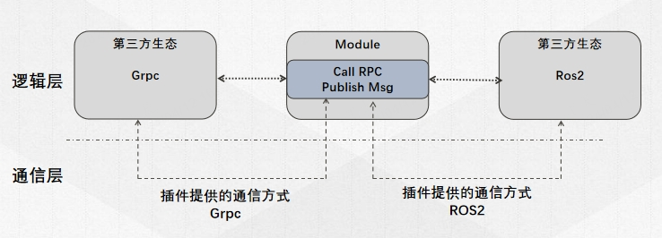

# AimRT 核心设计理念

## Initialize 阶段和 Start 阶段

在大部分领域，一个常驻型服务的运行过程通常分为两个阶段：
- **初始化阶段**：进行一些冗长的的初始化逻辑，只占整个运行过程的最开始一小段，在初始化成功后就进入运行阶段；
- **运行阶段**：进行循环的、高效的任务处理，会占据大部分的运行时间，直到进程因为某些原因被停止；

根据这两个阶段的特点可以发现，保障**运行阶段**的执行效率更为重要，而**初始化阶段**的执行效率则相对不是太重要。

AimRT 根据这个理论前提，将整个运行时间分为`Initialize`阶段和`Start`阶段，在`Initialize`阶段尽可能的将所有运行时需要的资源都申请、注册、初始化完毕，尽量保证在`Start`阶段没有额外的资源申请、注册表加锁等操作，从而优化运行阶段效率。

具体到 AimRT 使用时，表现为有一些接口只能在`Initialize`阶段调用，而另一些接口只能在`Start`阶段调用。同时，AimRT 会保证`Initialize`阶段是单线程进行的，减少开发者在线程安全等方面额外的精力。另外，AimRT 还可以在`Initialize`结束后明确知晓自身需要的资源、通信关系，从而产出一份初始化报告，开发者可以在日志中查看或通过一些参数/接口导出初始化报告。

需要注意的是，AimRT 的`Initialize`阶段仅仅是 AimRT 框架自身的初始化阶段，可能只是整个服务**初始化阶段**的一部分。使用者可能还需要在 AimRT 的`Start`阶段先初始化自己的一些业务逻辑，比如检查上下游资源、进行一些配置等，然后再真正的进入整个服务的**运行阶段**。各个运行阶段关系如下图所示：

## 逻辑实现与部署运行分离
AimRT 的一个重要设计思想是：将逻辑开发与实际部署运行解耦。开发者在实现具体业务逻辑时，也就是写`Module`代码时，可以不用关心最终运行时的**部署方式**、**通信方式**。例如：在开发一个 RPC client 模块和一个 RPC server 模块时，用户只需要知道 client 发出去的请求，server 一定能接收到并进行处理，而不用关心最终 client 模块和 server 模块部署在哪里、以及 client 和 server 端数据是怎么通信的。如下图所示：

当用户开发完成后，再根据实际情况决定部署、通信方案。例如：
- 如果两个模块可以编译在一起，则 client-server 之间的通信可以直接传递数据指针。
- 如果后续两个模块需要进行稳定性解耦，则可以部署为同一台服务器上的两个进程，client-server 之间通过共享内存、本地回环等方式进行通信。
- 如果发现其中一个模块需要部署在机器人端，另一个需要部署在云端，则 client-server 之间可以通过 http、tcp 等方式进行通信。

而这些变化只需要用户修改配置、或简单修改 Pkg、Main 函数中的一些代码即可支持，不用修改任何原始的逻辑代码。

## AimRT 中的线程资源
AimRT 主张在初始化阶段就申请好所有需要使用的资源，因此线程资源也一样，需要用户在配置文件中提前声明。一般来说，一个 AimRT 进程运行时，所有运行的线程来源于三个方面：
- AimRT 框架本身启动的线程；
- 用户在启动配置文件中主动配置的线程；
- AimRT 框架加载的插件启动的线程；
- 用户在业务模块中自己启动的线程；

前两者属于 AimRT 框架管控的线程，第三个属于插件管控的线程，最后一个属于用户自己管控的线程；

如果不进行任何配置、不加载任何插件，AimRT 框架本身只会使用到两个线程：
- 主线程：即调用 AimRT `Initialize`和`Start`方法的线程，一般就是`main`函数所在的主线程。AimRT 一般在启动后将主线程阻塞，等待停止信号以调用`Shutdown`方法。
- 守护线程：AimRT 在启动后，会启动一个守护线程，会在守护线程中定时监测运行状态，对阻塞过长时间的情况发出告警，并作为默认的日志线程。

如果用户在配置文件中主动配置了执行器，AimRT 框架就会按照配置，在初始化阶段创建相应的线程或线程池资源，供用户在运行业务时使用。推荐开发者使用AimRT框架统一管控的线程资源，而不是自己手动创建线程，具体使用方式请参考执行器相关文档。

除此之外，插件引入的线程请参考对应插件的文档；用户在自己的业务代码中也完全可以使用原生的线程 API 创建自己的线程资源。

## 兼容第三方生态
AimRT 的底层通信是交给插件来执行的，也可以借此实现一些兼容第三方生态的功能。例如当`Module`通过`Channel`对外发布一个消息时，插件层可以将其编码为一个 ROS2 消息并发送到原生 ROS2 体系中，从而打通与原生 ROS2 节点的互通。并且 AimRT 底层可以加载多个插件，因此可以同时兼容不同的第三方生态。如下图所示：

