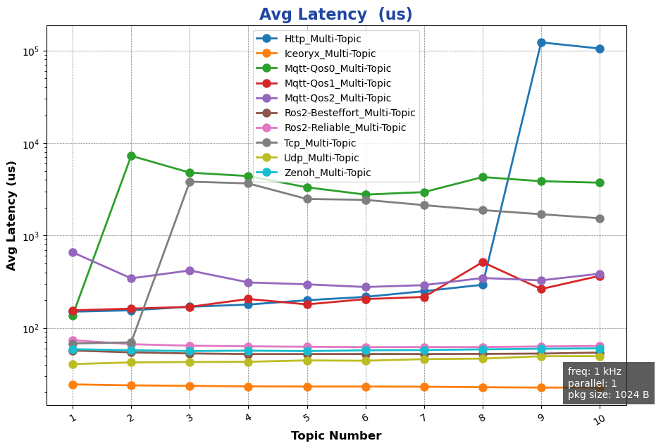
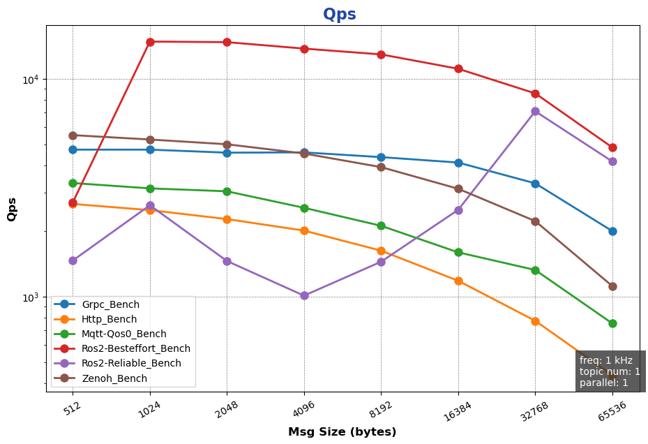
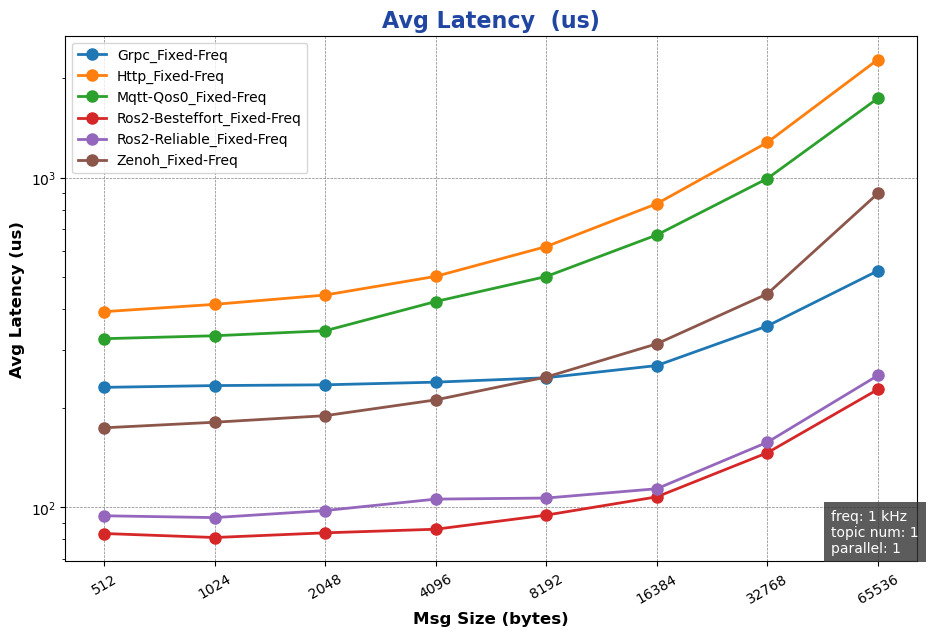
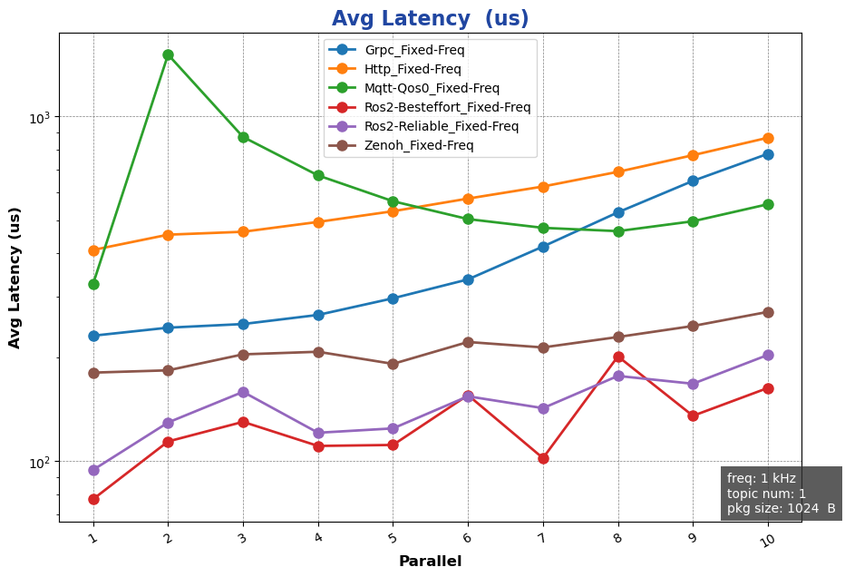
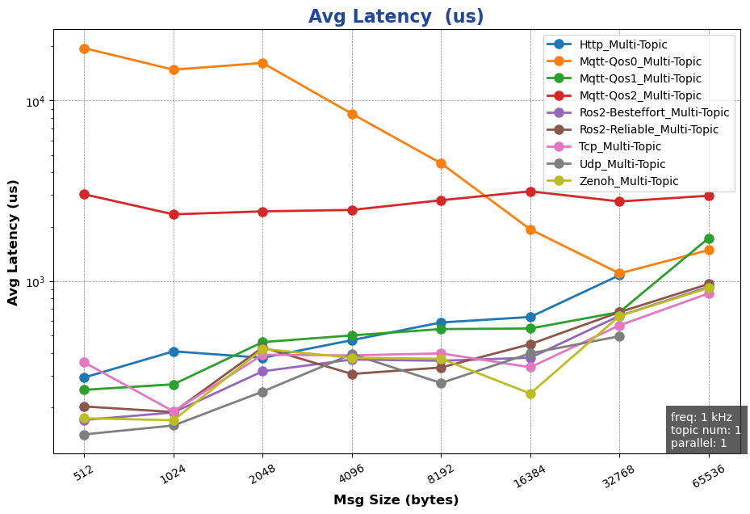
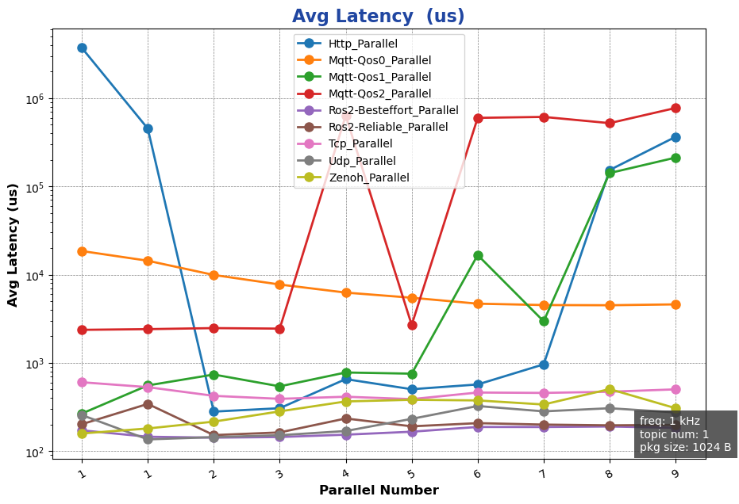
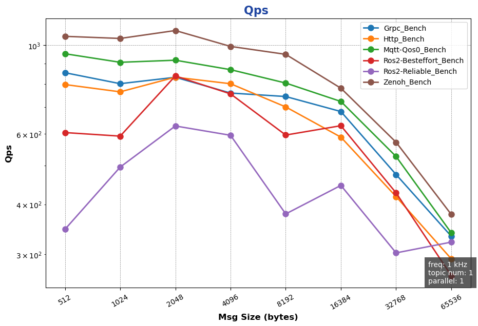
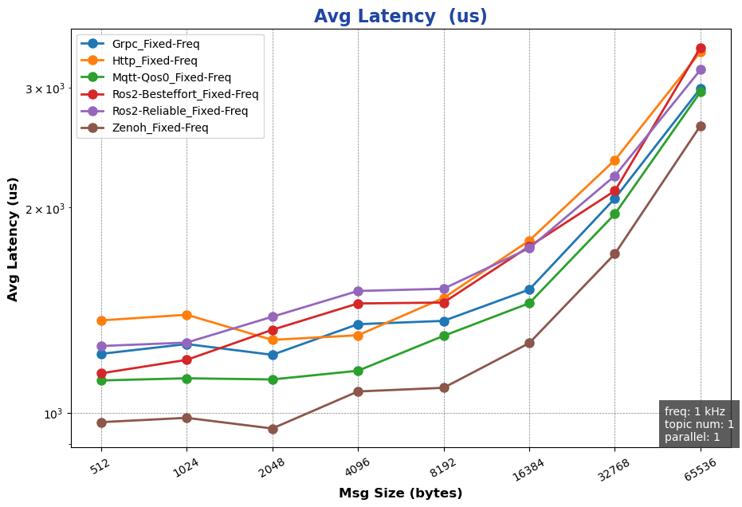

<table style="width: 100%; color: gray; font-size: 14px;">
<tr>
<td style="text-align: left;">NOTE: following tests were done in Mar. 2025, which may not reflect latest status of the package.</td>
</tr>
</table>

# AimRT 0.10.0-py &nbsp;性能测试报告

## 序言
AimRT 的通信层由插件实现，官方支持 iceoryx、ROS2、Zenoh、Http、Grpc、Mqtt 等通信插件，覆盖常见的端、云通信场景。这些插件可提供`发布-订阅`和`请求-响应`两种常见的通信模式以实现`本机`和`跨机`的多进程通信。

## 测试环境
- 系统环境：
  - 操作系统：
  - CPU：13th Gen Intel(R) Core(TM) i5-1350P
  - Linux 6.1.59-rt16

- 软件环境
  - AimRT 版本： 0.10.0

## 测试条目

使用 AimRT-py 进行测试，测试条目如下：
- 单机性能测试
  - Channel后端性能测试
    - [包尺寸对性能影响](#包尺寸对性能影响)
    - [话题数对性能影响](#话题数对性能影响)
    - [并发数对性能的影响](#并发数对性能的影响)
  - Rpc后端性能测试
    - [bench 模式下包尺寸对性能影响](#bench-模式下包尺寸对性能影响)
    - [fixed_freq 模式下包尺寸对性能影响](#fixed-freq-模式下包尺寸对性能影响)
    - [bench 模式下并发数对性能影响](#bench-模式下并发数对性能影响)
    - [fixed_freq 模式下并发数对性能影响](#fixed-freq-模式下并发数对性能影响)
- 多机性能测试
  - Channel后端性能测试
    - [包尺寸对性能影响](#包尺寸对性能影响-1)
    - [话题数对性能影响](#话题数对性能影响-1)
    - [并发数对性能的影响](#并发数对性能的影响-1)
  - Rpc后端性能测试
    - [bench 模式下包尺寸对性能影响](#bench-模式下包尺寸对性能影响-1)
    - [fixed_freq 模式下包尺寸对性能影响](#fixed-freq-模式下包尺寸对性能影响-1)
    - [bench 模式下并发数对性能影响](#bench-模式下并发数对性能影响-1)
    - [fixed_freq 模式下并发数对性能影响](#fixed-freq-模式下并发数对性能影响-1)
  
## 测试结果

### 单机性能测试（X86）

#### Channel 后端性能测试
##### 包尺寸对性能影响：
- 测试目的：单机跨进程 Channel 后端在不同`包尺寸`下性能测试
- 测试配置：
  - channel_frequency: 1 kHz
  - pkg_size: 256 B ~ 64 KB (2^8 ~ 2^16，按2的幂递增)
  - topic_number: 1 
  - parallel_number=1
- 测试结果：
  

##### 话题数对性能影响：
- 测试目的：单机跨进程 Channel 后端在不同`话题数`下性能测试
- 测试配置：
  - channel_frequency: 1 kHz
  - pkg_size: 1024 B
  - topic_number: 1 ～ 10 
  - parallel_number=1
- 测试结果：

##### 并发数对性能的影响：
- 测试目的：单机跨进程 Channel 后端在不同`并发数下性能测试
- 测试配置：
  - channel_frequency: 1 kHz
  - pkg_size: 1024 B
  - topic_number: 1 
  - parallel_number=1 ～ 10
- 测试结果：
  

{{ '[详细数据]({}/document/sphinx-cn/tutorials/misc/performance_test/0.10.0/py/data/local_chn_data.csv)'.format(code_site_root_path_url) }}

#### Rpc 后端性能测试

##### bench 模式下包尺寸对性能影响:
- 测试目的：单机跨进程 Rpc 后端在 bench 模式下不同`包尺寸`下性能测试
- 测试配置：
  - mode: bench
  - channel_frequency: 1 kHz
  - pkg_size: 256 B ~ 64 KB (2^8 ~ 2^16，按2的幂递增)
  - paraller_number: 1
- 测试结果：
  

##### fixed-freq 模式下包尺寸对性能影响:
- 测试目的：单机跨进程 Rpc 后端在 fixed-freq 模式下不同`包尺寸`下性能测试
- 测试配置：
  - mode: fixed-freq
  - channel_frequency: 1 kHz
  - pkg_size: 256 B ~ 64 KB (2^8 ~ 2^16，按2的幂递增)
  - paraller_number: 1
- 测试结果：
  

##### bench 模式下并发数对性能影响:
- 测试目的：单机跨进程 Rpc 后端在 bench 模式下不同`并发数`下性能测试
- 测试配置：
  - mode: bench
  - channel_frequency: 1 kHz
  - pkg_size: 1024 B  
  - paraller_number: 1 ～ 10
- 测试结果：

##### fixed-freq 模式下并发数对性能影响:
- 测试目的：单机跨进程 Rpc 后端在 fixed-freq 模式下不同`并发数`下性能测试
- 测试配置：  
  - mode: fixed-freq
  - channel_frequency: 1 kHz
  - pkg_size: 1024 B  
  - paraller_number: 1 ～ 10
- 测试结果：

{{ '[详细数据]({}/document/sphinx-cn/tutorials/misc/performance_test/0.10.0/py/data/local_rpc_data.csv)'.format(code_site_root_path_url) }}

### 跨机性能测试
#### Channel 后端性能测试
##### 包尺寸对性能影响：
- 测试目的：单机跨进程 Channel 后端在不同`包尺寸`下性能测试
- 测试配置：
  - channel_frequency: 1 kHz
  - pkg_size: 256 B ~ 64 KB (2^8 ~ 2^16，按2的幂递增)
  - topic_number: 1 
  - parallel_number=1
- 测试结果：

##### 话题数对性能影响：
- 测试目的：单机跨进程 Channel 后端在不同`话题数`下性能测试
- 测试配置：
  - channel_frequency: 1 kHz
  - pkg_size: 1024 B
  - topic_number: 1 ～ 10 
  - parallel_number=1
- 测试结果：

##### 并发数对性能的影响：
- 测试目的：单机跨进程 Channel 后端在不同`并发数下性能测试
- 测试配置：
  - channel_frequency: 1 kHz
  - pkg_size: 1024 B
  - topic_number: 1 
  - parallel_number=1 ～ 10
- 测试结果：
  

{{ '[详细数据]({}/document/sphinx-cn/tutorials/misc/performance_test/0.10.0/py/data/cross-machine_chn_data.csv)'.format(code_site_root_path_url) }}

#### Rpc 后端性能测试

##### bench 模式下包尺寸对性能影响:
- 测试目的：单机跨进程 Rpc 后端在 bench 模式下不同`包尺寸`下性能测试
- 测试配置：
  - mode: bench
  - channel_frequency: 1 kHz
  - pkg_size: 256 B ~ 64 KB (2^8 ~ 2^16，按2的幂递增)
  - paraller_number: 1
- 测试结果：

##### fixed-freq 模式下包尺寸对性能影响:
- 测试目的：单机跨进程 Rpc 后端在 fixed-freq 模式下不同`包尺寸`下性能测试
- 测试配置：
  - mode: fixed-freq
  - channel_frequency: 1 kHz
  - pkg_size: 256 B ~ 64 KB (2^8 ~ 2^16，按2的幂递增)
  - paraller_number: 1
- 测试结果：

##### bench 模式下并发数对性能影响:
- 测试目的：单机跨进程 Rpc 后端在 bench 模式下不同`并发数`下性能测试
- 测试配置：
  - mode: bench
  - channel_frequency: 1 kHz
  - pkg_size: 1024 B  
  - paraller_number: 1 ～ 10
- 测试结果：

##### fixed-freq 模式下并发数对性能影响:
- 测试目的：单机跨进程 Rpc 后端在 fixed-freq 模式下不同`并发数`下性能测试
- 测试配置：  
  - mode: fixed-freq
  - channel_frequency: 1 kHz
  - pkg_size: 1024 B  
  - paraller_number: 1 ～ 10
- 测试结果：

{{ '[详细数据]({}/document/sphinx-cn/tutorials/misc/performance_test/0.10.0/py/data/cross-machine_rpc_data.csv)'.format(code_site_root_path_url) }}
