<table style="width: 100%; color: gray; font-size: 14px;">
<tr>
<td style="text-align: left;">NOTE: following tests were done in May. 2025, which may not reflect latest status of the package.</td>
</tr>
</table>

# AimRT 1.2.0-cpp &nbsp;性能测试报告

## 序言

AimRT 的通信层由插件实现，官方支持 Iceoryx、ROS2、Zenoh、Net、Grpc、Mqtt 等插件作为通信后端，覆盖常见的端、云通信场景。这些插件可提供`发布-订阅(Channel)`和`请求-响应(Rpc)`两种常见的通信模式以实现`本机`和`跨机`的多进程通信。

## 测试环境

- 系统环境：

  - 操作系统：6.1.59-rt16 x86_64 GNU/Linux
  - CPU：13th Gen Intel(R) Core(TM) i5-1350P
  - 总内存/可用内存: 62Gi / 38Gi

- 软件环境：
  - AimRT 版本： 1.2.0

## 测试条目

使用 AimRT-cpp 进行测试，测试条目如下：

- 单机性能测试
  - Channel 后端性能测试
    - multi-topic 模式下包尺寸对性能影响
    - multi-topic 模式下话题数对性能影响
    - parallel 模式下包尺寸对性能影响
    - parallel 模式下并发数对性能影响
  - Rpc 后端性能测试
    - bench 模式下包尺寸对性能影响
    - bench 模式下并发数对性能影响
    - fixed_freq 模式下包尺寸对性能影响
    - fixed_freq 模式下并发数对性能影响
- 多机性能测试
  - Channel 后端性能测试
    - multi-topic 模式下包尺寸对性能影响
    - multi-topic 模式下话题数对性能影响
    - parallel 模式下包尺寸对性能影响
    - parallel 模式下并发数对性能影响
  - Rpc 后端性能测试
    - bench 模式下包尺寸对性能影响
    - bench 模式下并发数对性能影响
    - fixed_freq 模式下包尺寸对性能影响
    - fixed_freq 模式下并发数对性能影响

注： 用于进行测试的消息类型除 ros2 后端使用 ros2_msg 协议外，其余通信后端均采用 protobuf 协议。

## 测试结果

### 单机性能测试（X86）

#### Channel 后端性能测试

##### multi-topic 模式下包尺寸对性能影响：

- 测试目的：单机跨进程 Channel 后端在 multi-topic 模式下不同`包尺寸`下性能测试
- 测试配置：
  - channel_frequency: 1 kHz
  - pkg_size: 256 B ~ 64 KB (2^8 ~ 2^16，按 2 的幂递增)
  - topic_number: 1
  - parallel_number=1
- 测试结果：

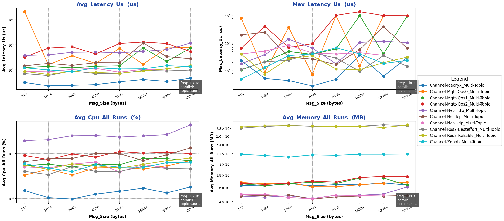

##### multi-topic 模式下话题数对性能影响：

- 测试目的：单机跨进程 Channel 后端在 multi-topic 模式下不同`话题数`下性能测试
- 测试配置：
  - channel_frequency: 1 kHz
  - pkg_size: 1024 B
  - topic_number: 1 ～ 10
  - parallel_number=1
- 测试结果：

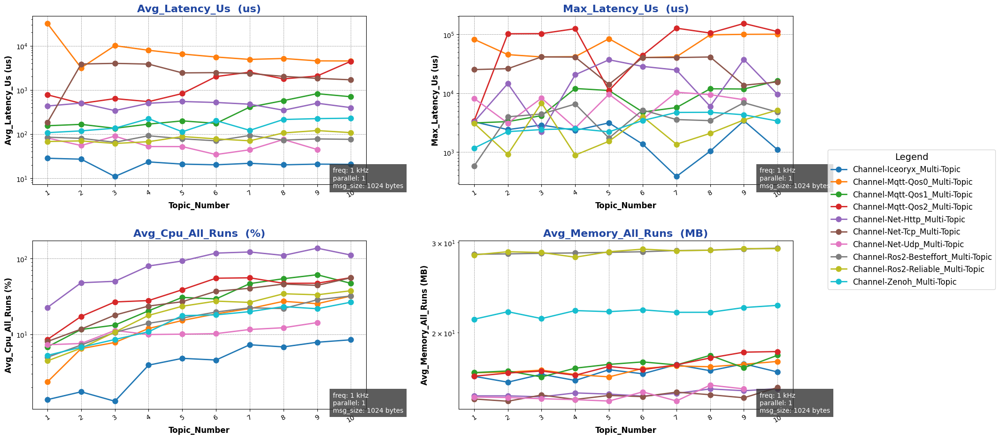

##### parallel 模式下包尺寸对性能的影响：

- 测试目的：单机跨进程 Channel 后端在 parallel 模式下不同`包尺寸`下性能测试
- 测试配置：
  - channel_frequency: 1 kHz
  - pkg_size: 1024 B
  - topic_number: 1
  - parallel_number=1 ～ 10
- 测试结果：

##### parallel 模式下并发数对性能的影响：

- 测试目的：单机跨进程 Channel 后端在 parallel 模式下不同`并发数`下性能测试
- 测试配置：
  - channel_frequency: 1 kHz
  - pkg_size: 1024 B
  - topic_number: 1
  - parallel_number=1 ～ 10
- 测试结果：

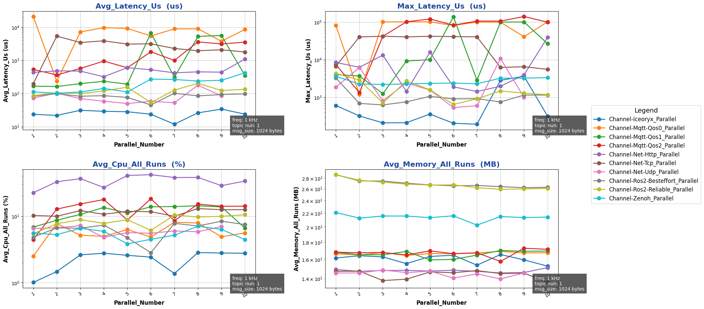

{{ '[详细数据]({}/document/sphinx-cn/tutorials/misc/performance_test/1.0.0/cpp/data/result_channel_local_cpp.csv)'.format(code_site_root_path_url) }}

#### Rpc 后端性能测试

##### bench 模式下包尺寸对性能影响:

- 测试目的：单机跨进程 Rpc 后端在 bench 模式下不同`包尺寸`下性能测试
- 测试配置：
  - mode: bench
  - channel_frequency: 1 kHz
  - pkg_size: 256 B ~ 64 KB (2^8 ~ 2^16，按 2 的幂递增)
  - paraller_number: 1
- 测试结果：

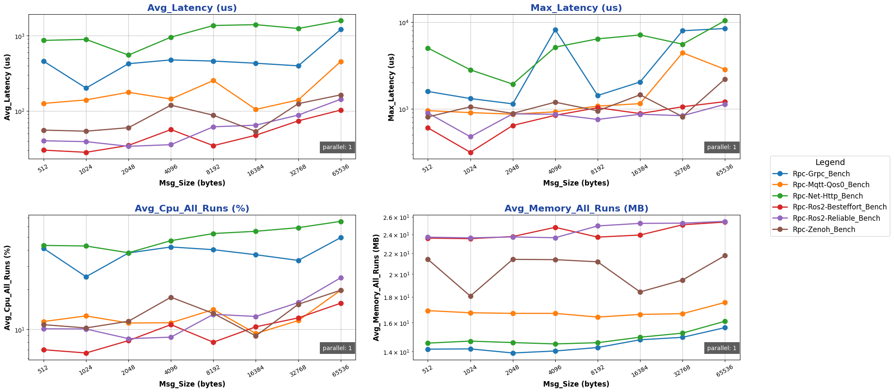

##### bench 模式下并发数对性能影响:

- 测试目的：单机跨进程 Rpc 后端在 bench 模式下不同`并发数`下性能测试
- 测试配置：
  - mode: bench
  - channel_frequency: 1 kHz
  - pkg_size: 1024 B
  - paraller_number: 1 ～ 10
- 测试结果：

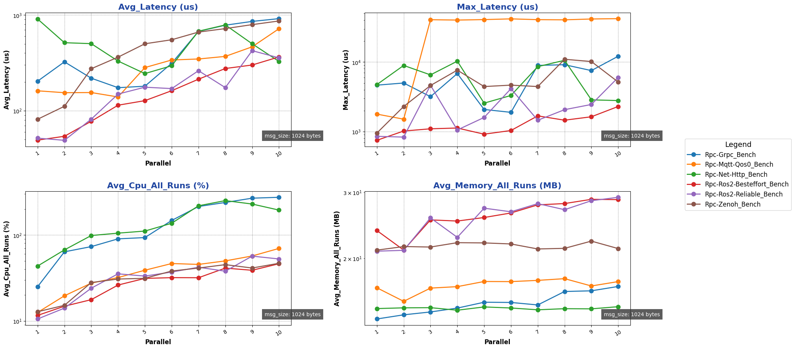

##### fixed-freq 模式下包尺寸对性能影响:

- 测试目的：单机跨进程 Rpc 后端在 fixed-freq 模式下不同`包尺寸`下性能测试
- 测试配置：
  - mode: fixed-freq
  - channel_frequency: 1 kHz
  - pkg_size: 256 B ~ 64 KB (2^8 ~ 2^16，按 2 的幂递增)
  - paraller_number: 1
- 测试结果：

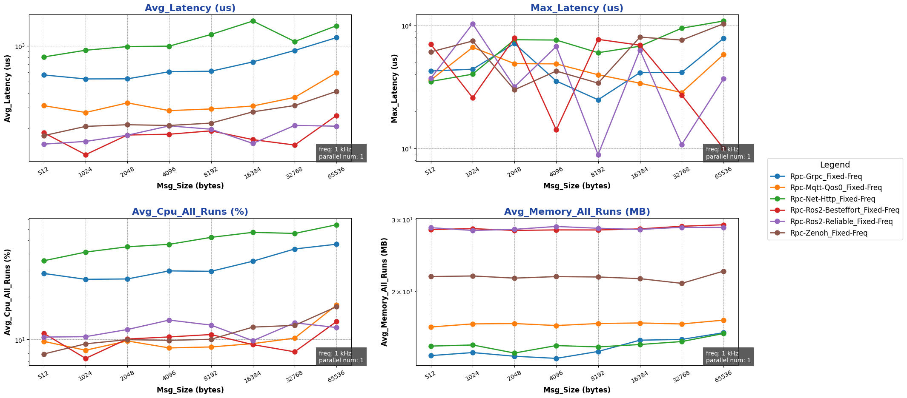

##### fixed-freq 模式下并发数对性能影响:

- 测试目的：单机跨进程 Rpc 后端在 fixed-freq 模式下不同`并发数`下性能测试
- 测试配置：
  - mode: fixed-freq
  - channel_frequency: 1 kHz
  - pkg_size: 1024 B
  - paraller_number: 1 ～ 10
- 测试结果：

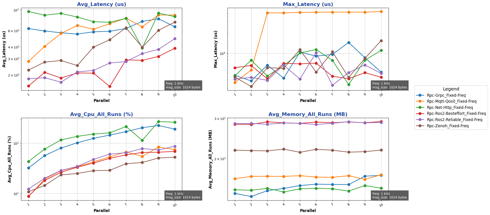

{{ '[详细数据]({}/document/sphinx-cn/tutorials/misc/performance_test/1.0.0/cpp/data/result_rpc_local_cpp.csv)'.format(code_site_root_path_url) }}

### 跨机性能测试

#### Channel 后端性能测试

##### multi-topic 模式下包尺寸对性能影响：

- 测试目的：单机跨进程 Channel 后端在 multi-topic 模式下不同`包尺寸`下性能测试
- 测试配置：
  - channel_frequency: 1 kHz
  - pkg_size: 256 B ~ 64 KB (2^8 ~ 2^16，按 2 的幂递增)
  - topic_number: 1
  - parallel_number=1
- 测试结果：

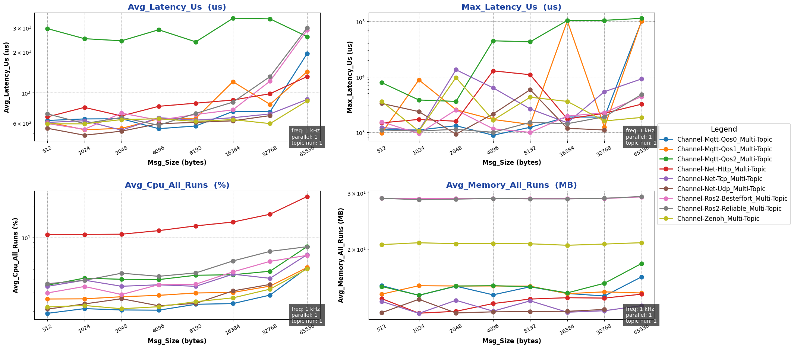

##### multi-topic 模式下话题数对性能影响：

- 测试目的：单机跨进程 Channel 后端在 multi-topic 模式下不同`话题数`下性能测试
- 测试配置：
  - channel_frequency: 1 kHz
  - pkg_size: 1024 B
  - topic_number: 1 ～ 10
  - parallel_number=1
- 测试结果：

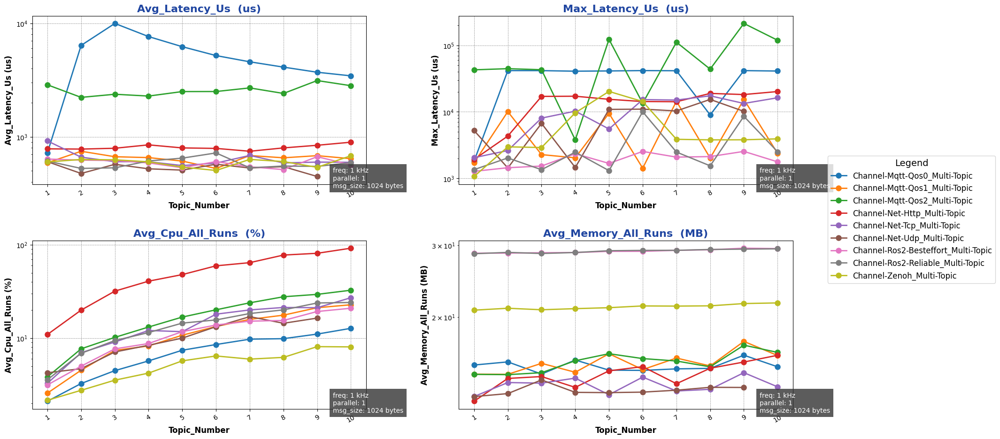

##### parallel 模式下包尺寸对性能的影响：

- 测试目的：单机跨进程 Channel 后端在 parallel 模式下不同`包尺寸`下性能测试
- 测试配置：
  - channel_frequency: 1 kHz
  - pkg_size: 1024 B
  - topic_number: 1
  - parallel_number=1 ～ 10
- 测试结果：

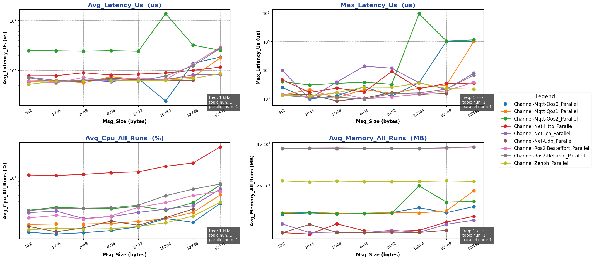

##### parallel 模式下并发数对性能的影响：

- 测试目的：单机跨进程 Channel 后端在 parallel 模式下不同`并发数`下性能测试
- 测试配置：
  - channel_frequency: 1 kHz
  - pkg_size: 1024 B
  - topic_number: 1
  - parallel_number=1 ～ 10
- 测试结果：

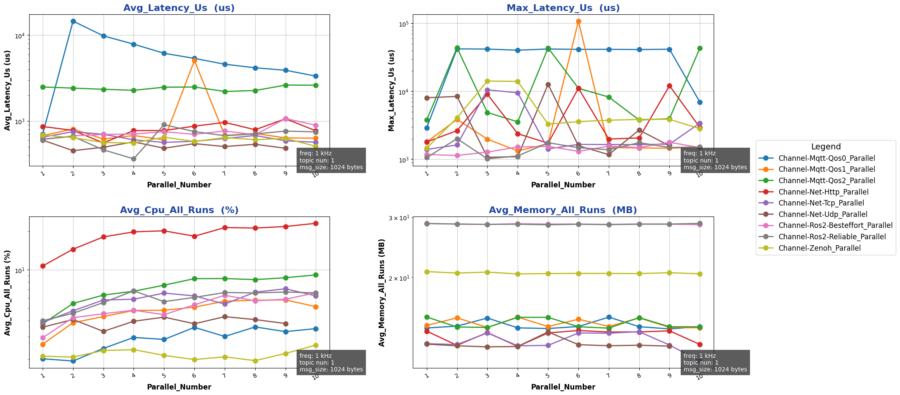

{{ '[详细数据]({}/document/sphinx-cn/tutorials/misc/performance_test/1.0.0/cpp/data/result_channel_cross_cpp.csv)'.format(code_site_root_path_url) }}

#### Rpc 后端性能测试

##### bench 模式下包尺寸对性能影响:

- 测试目的：单机跨进程 Rpc 后端在 bench 模式下不同`包尺寸`下性能测试
- 测试配置：
  - mode: bench
  - channel_frequency: 1 kHz
  - pkg_size: 256 B ~ 64 KB (2^8 ~ 2^16，按 2 的幂递增)
  - paraller_number: 1
- 测试结果：

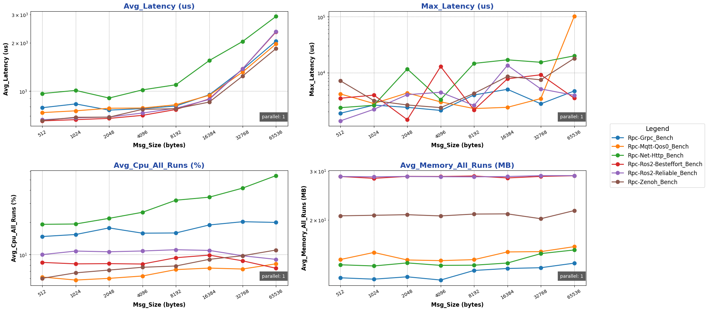

##### bench 模式下并发数对性能影响:

- 测试目的：单机跨进程 Rpc 后端在 bench 模式下不同`并发数`下性能测试
- 测试配置：
  - mode: bench
  - channel_frequency: 1 kHz
  - pkg_size: 1024 B
  - paraller_number: 1 ～ 10
- 测试结果：

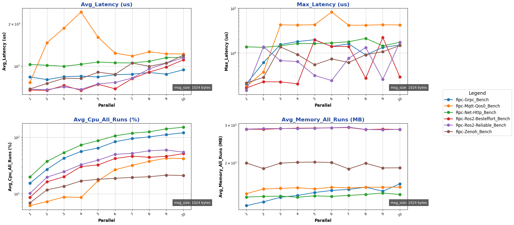

##### fixed-freq 模式下包尺寸对性能影响:

- 测试目的：单机跨进程 Rpc 后端在 fixed-freq 模式下不同`包尺寸`下性能测试
- 测试配置：
  - mode: fixed-freq
  - channel_frequency: 1 kHz
  - pkg_size: 256 B ~ 64 KB (2^8 ~ 2^16，按 2 的幂递增)
  - paraller_number: 1
- 测试结果：

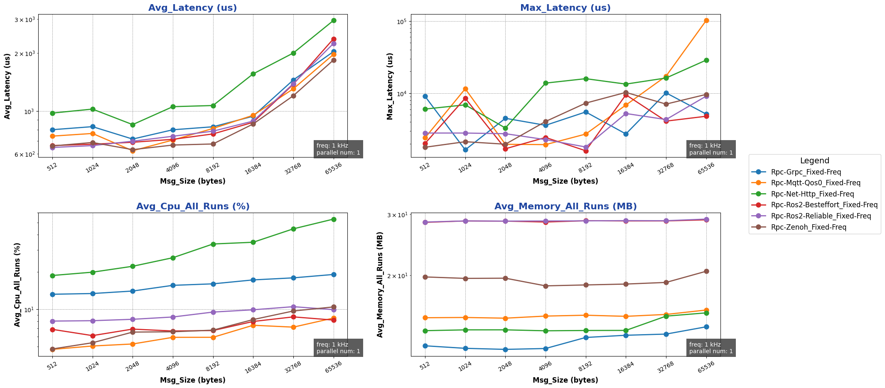

##### fixed-freq 模式下并发数对性能影响:

- 测试目的：单机跨进程 Rpc 后端在 fixed-freq 模式下不同`并发数`下性能测试
- 测试配置：
  - mode: fixed-freq
  - channel_frequency: 1 kHz
  - pkg_size: 1024 B
  - paraller_number: 1 ～ 10
- 测试结果：

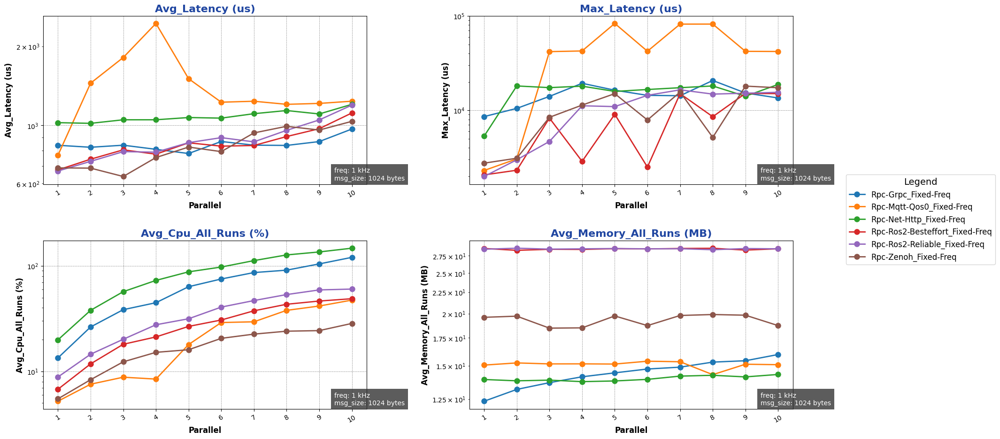

{{ '[详细数据]({}/document/sphinx-cn/tutorials/misc/performance_test/1.0.0/cpp/data/result_rpc_cross_cpp.csv)'.format(code_site_root_path_url) }}
