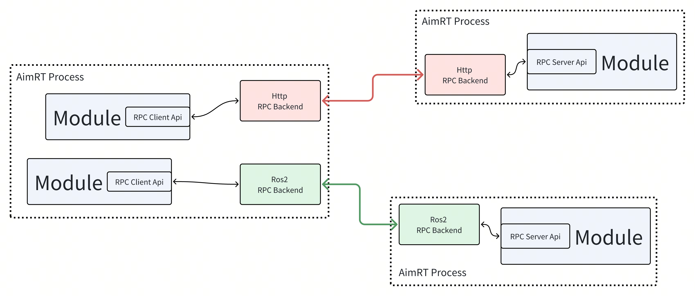
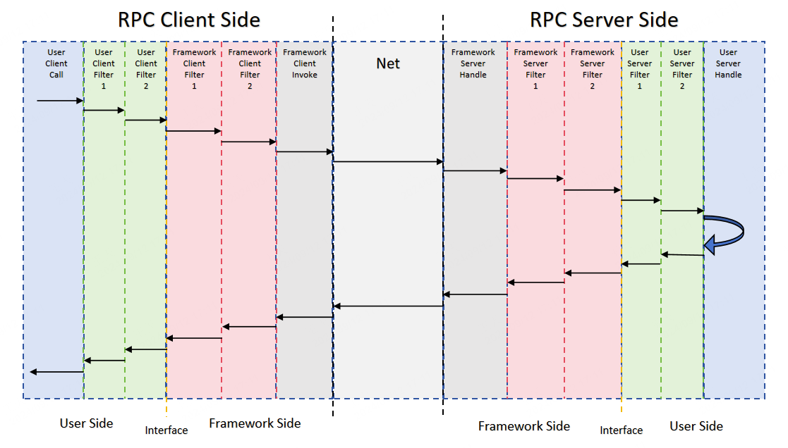

# Basic Concepts in AimRT


## Contents of the AimRT Framework

Refer to the `src` directory in the AimRT source code; the AimRT framework contains the following:

```
src
├── common --------------------------------- // 一些基础的、可以直接使用的通用组件，例如 string、log 接口、buffer 等
├── examples ------------------------------- // AimRT 官方示例
│   ├── cpp -------------------------------- // CPP 接口的示例
│   ├── py --------------------------------- // Python 接口的示例
│   └── plugins ---------------------------- // 插件的使用示例
├── interface ------------------------------ // AimRT 接口层
│   ├── aimrt_core_plugin_interface -------- // [CPP] 插件开发接口
│   ├── aimrt_module_c_interface ----------- // [C] 模块开发接口
│   ├── aimrt_module_cpp_interface --------- // [CPP] 模块开发接口，对 C 版本的封装
│   ├── aimrt_module_protobuf_interface ---- // [CPP] 与 protobuf 相关的模块开发接口，基于 CPP 版本接口
│   ├── aimrt_module_ros2_interface -------- // [CPP] 与 ROS2 相关的模块开发接口，基于 CPP 版本接口
│   ├── aimrt_pkg_c_interface -------------- // [C] Pkg 开发接口
│   └── aimrt_type_support_pkg_c_interface - // [C] Type support 包接口
├── plugins -------------------------------- // AimRT 官方插件
├── protocols ------------------------------ // AimRT 官方标准协议
├── runtime -------------------------------- // AimRT 运行时
│   ├── core ------------------------------- // 运行时核心库
│   ├── main ------------------------------- // 基于 core 实现的一个主进程"aimrt_main"
│   └── python_runtime --------------------- // 基于 pybind11 封装的 python 版本运行时
└── tools ---------------------------------- // 一些配套工具
```


## The "Module" Concept in AimRT
Like most frameworks, AimRT has a concept for identifying independent logical units: `Module`. A `Module` is a logical-level concept representing a logically cohesive block. Modules can communicate at the logical layer through two abstract interfaces: `Channel` and `RPC`. You can create a `Module` by implementing a few simple interfaces.

A `Module` usually corresponds to a hardware abstraction, an independent algorithm, or a business feature. A `Module` can use handles provided by the framework to invoke various runtime capabilities such as configuration, logging, executors, etc. The handles provided by the framework to each `Module` are also isolated to enable resource statistics and management.

## The "Node" Concept in AimRT
A `Node` represents a deployable and launchable process in which a Runtime instance of the AimRT framework is running. A `Node` is a deployment and runtime-level concept; there may be multiple `Modules` in one `Node`. When a `Node` starts, it can set runtime parameters such as logs, plugins, and executors via a configuration file.

## The "Pkg" Concept in AimRT
`Pkg` is one way the AimRT framework runs `Modules`. A `Pkg` represents a dynamic library containing one or more `Modules`; a `Node` can load one or more `Pkg`s at runtime. You can create a `Pkg` by implementing a few simple module-description interfaces.

The `Module` concept focuses more on the code-logic level, whereas `Pkg` is a deployment-level concept that contains no business-logic code. When compatible, it is recommended to compile multiple `Modules` into a single `Pkg`; in this case, performance is optimized when using RPC, Channel, and other features.

Symbols in a `Pkg` are usually hidden by default, exposing only limited pure-C interfaces, so different `Pkg`s do not interfere with each other symbolically. Different `Pkg`s can theoretically be compiled independently with different compiler versions, and `Modules` in different `Pkg`s can use conflicting third-party dependencies. The resulting `Pkg` can be distributed as a binary.

## Two Ways to Integrate Business Logic in the AimRT Framework
The AimRT framework can integrate business logic in two ways: **App Mode** and **Pkg Mode**. Which one to use depends on the specific scenario. The differences are as follows:
- **App Mode**: In the developer’s own `main` function, directly link the AimRT runtime library and compile the business-logic code into the main program at build time:
  - **Advantages**: No `dlopen` step, no `.so`, only a final `.exe`.
  - **Disadvantages**: Possible third-party library conflicts; cannot release a `Module` independently—binary release can only be done by releasing the entire `.exe`.
  - **Use case**: Generally used for small tools or small demos with low module-decoupling requirements.
- **Pkg Mode**: Use the **aimrt_main** executable provided by AimRT, which loads dynamic-library `Pkg`s at runtime according to the configuration file and imports the `Module` classes inside:
  - **Advantages**: When compiling business `Modules`, you only need to link a very lightweight AimRT interface layer, not the full AimRT runtime library, reducing potential dependency conflicts; can release `.so` binaries; better isolation.
  - **Disadvantages**: The framework loads `Pkg`s via `dlopen`, which may have compatibility issues in very rare scenarios.
  - **Use case**: Generally used for medium-to-large projects with strong requirements for module decoupling and binary release.

Regardless of which mode is chosen, the business logic is unaffected, and the two modes can coexist; the choice depends on the specific scenario.

Note that the above two modes apply only to the C++ development interface. If you are using Python, only **App Mode** is supported.

## The "Protocol" Concept in AimRT
`Protocol` means protocol, representing the data format for communication between `Modules`. It describes the field information of the data and the serialization/deserialization method—for example, the data format agreed upon between a publisher and subscriber of a `Channel`, or the request/response packet format between an RPC client and server. It is usually described by an `IDL` (Interface Description Language) and then converted into code for various languages by some tool.

AimRT currently officially supports two IDLs:
- Protobuf
- ROS2 msg/srv

However, AimRT does not restrict the specific type of protocol or IDL; users can implement other IDLs, such as Thrift IDL, FlatBuffers, or even custom IDLs.

## The "Channel" Concept in AimRT
`Channel`, also called a data channel, is a typical communication-topology concept. It identifies a single data channel via `Topic`, composed of a publisher (`Publisher`) and subscribers (`Subscriber`), where subscribers can receive data published by the publisher. `Channel` is a many-to-many topology; a `Module` can publish to any number of `Topics` and subscribe to any number of `Topics`. Similar concepts include ROS Topics, Kafka/RabbitMQ, and other message queues.

In AimRT, a Channel consists of an `interface layer` and a `backend`, which are decoupled. The interface layer defines an abstract API representing the logical `Channel`; the backend is responsible for the actual data transmission and can have multiple types. AimRT officially provides some Channel backends, such as mqtt, ros2, etc., and users can also develop new Channel backends.

When developers use the Channel feature in AimRT, they first call the interface-layer API in the business-logic layer to publish data to a Topic or subscribe to a Topic. Then the AimRT framework selects one or more Channel backends according to certain rules; these backends send the data to other nodes via specific methods, where the corresponding Channel backend on the other node receives the data and passes it to the business-logic layer. The entire logical flow is shown below:


## The "Rpc" Concept in AimRT
`RPC`, also called Remote Procedure Call, is based on a request-reply model, composed of a client (`Client`) and a server (`Server`). A `Module` can create a client handle to initiate a specific RPC request, which is received and replied to by a designated server or a server selected by the framework according to certain rules. A `Module` can also create a server handle to provide a specific RPC service, receiving and processing requests routed by the system and replying. Similar concepts include ROS Services, gRPC/Thrift, and other RPC frameworks.

In AimRT, RPC also consists of an `interface layer` and a `backend`, which are decoupled. The interface layer defines the abstract RPC API, while the backend is responsible for the actual RPC call. AimRT officially provides some RPC backends, such as http, ros2, etc., and users can also develop new RPC backends.

When developers use AimRT’s RPC feature, they first call the interface-layer API in the business-logic layer to initiate an RPC call via the Client. The AimRT framework selects an RPC backend according to certain rules; it sends the data to the Server node via specific methods, where the corresponding Rpc backend on the Server node receives the data and passes it to the business layer, and then returns the business-layer response to the Client. The entire logical flow is shown below:



## The "Filter" Concept in AimRT
AimRT provides a `Filter` feature to enhance RPC or Channel capabilities. A Filter is a user-customizable logic insertion point adjacent to the Interface layer. According to its position relative to the Interface layer, it is divided into framework-side Filters (Framework Filter) and user-side Filters (User Filter). According to its service function, it is divided into RPC Filters and Channel Filters.

A Filter is triggered every time an RPC or Channel is invoked, operating in an onion-like structure to perform custom actions before and after the RPC or Channel call, such as measuring time or reporting metrics. Taking an RPC Filter as an example, its runtime flow is shown below:



## The "Executor" Concept in AimRT
`Executor`, or executor, is an abstract concept that can run tasks. An executor can be a Fiber, Thread, or Thread Pool. The code we usually write also directly specifies an executor by default: the Main thread. Generally, anything that provides the following interface can be considered an executor:

```cpp
void Execute(std::function<void()>&& task);
```


There is also a type of `Executor` that provides timed execution, allowing tasks to be executed at a specific time or after a certain delay. Its interface is similar to the following:

```cpp
void ExecuteAt(std::chrono::system_clock::time_point tp, std::function<void()>&& task);
void ExecuteAfter(std::chrono::nanoseconds dt, std::function<void()>&& task);
```


In AimRT, executor functionality consists of an **interface layer** and **actual executor implementations**, which are decoupled. The interface layer defines the abstract executor API, providing interfaces for submitting tasks. The implementation layer is responsible for the actual task execution, behaving differently depending on the implementation type. AimRT officially provides several executors, such as an Asio-based thread pool, a TBB-based lock-free thread pool, and a time-wheel-based timed executor.

When developers use AimRT’s executor feature, they package a task into a closure in the business layer and then call the interface-layer API to submit the task to a specific executor. The executor will execute the submitted task at an appropriate time according to its scheduling policy. The specific logical flow is shown below:


## The "Plugin" Concept in AimRT
`Plugin` refers to a dynamic library that can register various custom functions with the AimRT framework. It can be loaded by the framework at runtime or registered into the framework via hard-coded means in a user-defined executable. The AimRT framework exposes a large number of hook points and query interfaces, such as:
- Log backend registration interface
- Channel/Rpc backend registration interface
- Channel/Rpc registry query interface
- Hook points for component startup
- RPC/Channel call filters
- Module information query interface
- Executor registration interface
- Executor query interface
- …

Users can directly use some officially provided AimRT plugins, seek plugins from third-party developers, or implement their own plugins to enhance the framework’s service capabilities and meet specific needs.