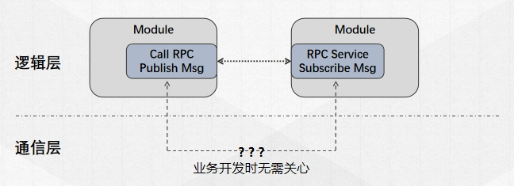

# AimRT Core Design Philosophy

## Initialize Phase and Start Phase

In most domains, the lifecycle of a long-running service is typically divided into two phases:
- **Initialization phase**: Performs lengthy initialization logic, occupying only a small portion at the very beginning of the entire runtime. After successful initialization, it transitions to the running phase.
- **Running phase**: Performs cyclic, high-efficiency task processing, taking up most of the runtime until the process is terminated for some reason.

Based on the characteristics of these two phases, it can be observed that ensuring the execution efficiency of the **running phase** is more important, while the execution efficiency of the **initialization phase** is relatively less critical.

Based on this theoretical premise, AimRT divides the entire runtime into the `Initialize` phase and the `Start` phase. During the `Initialize` phase, all resources required at runtime are allocated, registered, and initialized as much as possible, ensuring that there are no additional resource allocations, registry locks, or similar operations during the `Start` phase, thereby optimizing the efficiency of the running phase.

Specifically, when using AimRT, some interfaces can only be called during the `Initialize` phase, while others can only be called during the `Start` phase. At the same time, AimRT guarantees that the `Initialize` phase is single-threaded, reducing the extra effort developers need to spend on thread safety and other aspects. Additionally, after the `Initialize` phase ends, AimRT can clearly understand the resources it needs and the communication relationships, thereby generating an initialization report. Developers can view this report in the logs or export it through some parameters/interfaces.

It should be noted that the `Initialize` phase of AimRT is only the initialization phase of the AimRT framework itself and may only be a part of the entire service's **initialization phase**. Users may still need to initialize some of their own business logic during AimRT's `Start` phase, such as checking upstream and downstream resources and performing some configurations, before truly entering the **running phase** of the entire service. The relationship between the various runtime phases is shown in the figure below:

## Decoupling Logical Implementation from Deployment and Execution

An important design philosophy of AimRT is to decouple logical development from actual deployment and execution. When developers implement specific business logic, i.e., when writing `Module` code, they do not need to concern themselves with the final **deployment method** or **communication method** at runtime. For example, when developing an RPC client module and an RPC server module, users only need to know that the request sent by the client will definitely be received and processed by the server, without needing to care about where the client and server modules are ultimately deployed or how the data is communicated between the client and server. As shown in the figure below:

After the user completes development, they can then decide on the deployment and communication scheme based on actual circumstances. For example:
- If the two modules can be compiled together, the communication between client and server can directly pass data pointers.
- If the two modules need to be decoupled for stability later, they can be deployed as two processes on the same server, with communication between client and server via shared memory, local loopback, etc.
- If one module needs to be deployed on the robot side and the other in the cloud, the communication between client and server can be via http, tcp, etc.

These changes only require the user to modify configurations or make simple changes to some code in the Pkg and Main functions, without needing to modify any original logical code.

## Thread Resources in AimRT

AimRT advocates allocating all required resources during the initialization phase, so thread resources are no exception. Users need to declare them in advance in the configuration file. Generally, when an AimRT process runs, all running threads come from three sources:
- Threads started by the AimRT framework itself;
- Threads actively configured by the user in the startup configuration file;
- Threads started by plugins loaded by the AimRT framework;
- Threads started by the user in the business module;

The first two are threads managed by the AimRT framework, the third is threads managed by plugins, and the last is threads managed by the user themselves.

If no configuration is made and no plugins are loaded, the AimRT framework itself will only use two threads:
- Main thread: The thread that calls the AimRT `Initialize` and `Start` methods, usually the main thread where the `main` function resides. After startup, AimRT generally blocks the main thread, waiting for a stop signal to call the `Shutdown` method.
- Daemon thread: After startup, AimRT will start a daemon thread, which periodically monitors the runtime status, issues alerts for situations where blocking occurs for too long, and serves as the default logging thread.

If the user actively configures executors in the configuration file, the AimRT framework will create corresponding threads or thread pool resources during the initialization phase according to the configuration, for users to use when running their business. It is recommended that developers use thread resources uniformly managed by the AimRT framework instead of manually creating threads. For specific usage, please refer to the executor-related documentation.

In addition, threads introduced by plugins should refer to the corresponding plugin documentation; users can also use native thread APIs to create their own thread resources in their business code.

## Compatibility with Third-Party Ecosystems

The underlying communication of AimRT is handled by plugins, which can also be used to implement compatibility with third-party ecosystems. For example, when a `Module` publishes a message externally via `Channel`, the plugin layer can encode it into a ROS2 message and send it to the native ROS2 system, thereby enabling interoperability with native ROS2 nodes. Moreover, AimRT's underlying layer can load multiple plugins, thus enabling compatibility with different third-party ecosystems simultaneously. As shown in the figure below:

