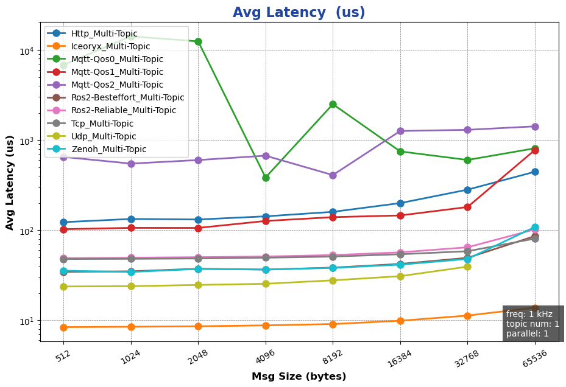
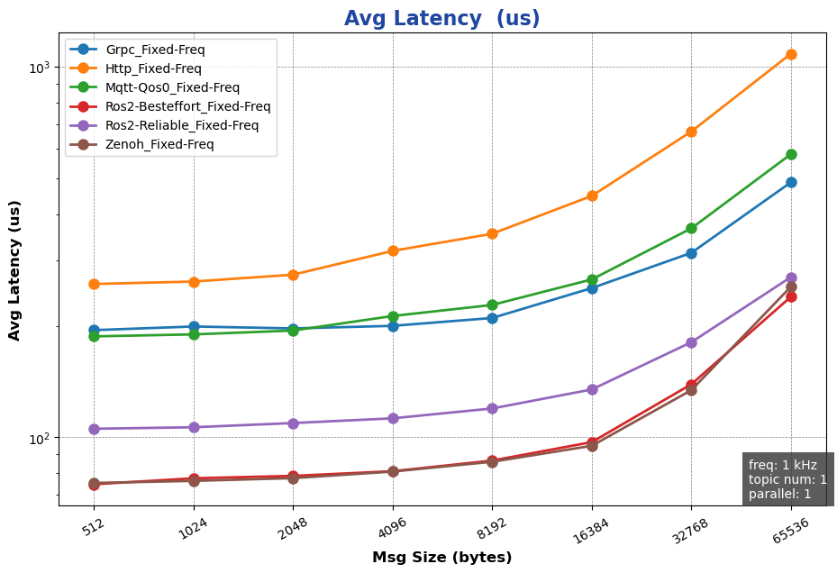
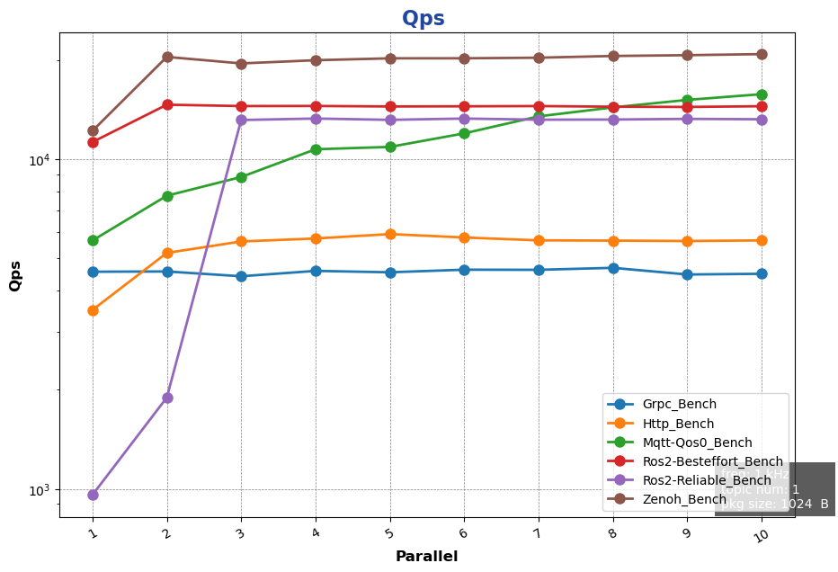
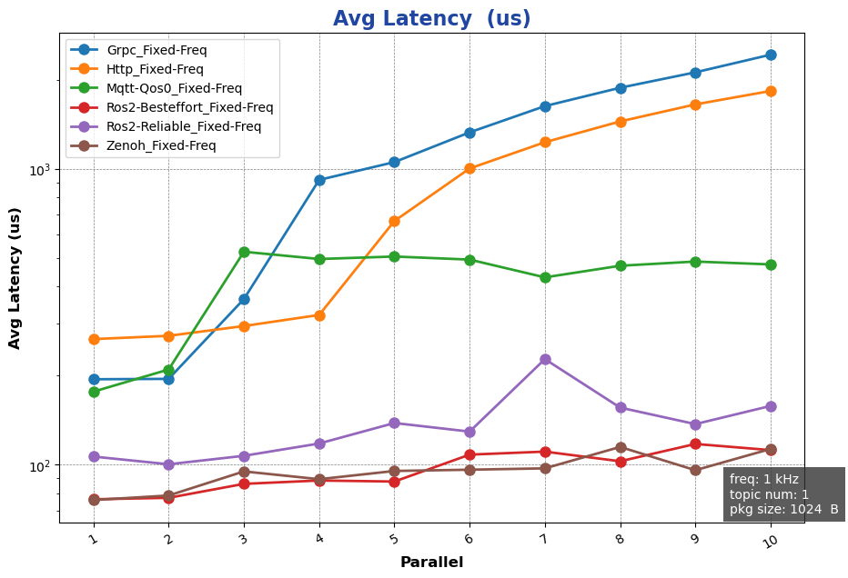

<table style="width: 100%; color: gray; font-size: 14px;">
<tr>
<td style="text-align: left;">NOTE: following tests were done in Mar. 2025, which may not reflect latest status of the package.</td>
</tr>
</table>

# AimRT 0.10.0-cpp &nbsp;Performance Test Report

## Preface
AimRT's communication layer is implemented through plugins, with official support for iceoryx, ROS2, Zenoh, Http, Grpc, Mqtt and other communication plugins, covering common edge and cloud communication scenarios. These plugins provide two common communication modes: `publish-subscribe` and `request-response` to achieve `intra-machine` and `cross-machine` multi-process communication.

## Test Environment
- System Environment:
  - Operating System:
  - CPU: 13th Gen Intel(R) Core(TM) i5-1350P
  - Linux 6.1.59-rt16

- Software Environment
  - AimRT Version: 0.10.0

## Test Items

Testing with AimRT-cpp includes the following items:
- Single-machine Performance Tests
  - Channel Backend Performance Tests
    - Impact of packet size on performance
    - Impact of topic count on performance
    - Impact of concurrency on performance
  - Rpc Backend Performance Tests
    - Impact of packet size on performance in bench mode
    - Impact of packet size on performance in fixed_freq mode
    - Impact of concurrency on performance in bench mode
    - Impact of concurrency on performance in fixed_freq mode
- Cross-machine Performance Tests
  - Channel Backend Performance Tests
    - Impact of packet size on performance
    - Impact of topic count on performance
    - Impact of concurrency on performance
  - Rpc Backend Performance Tests
    - Impact of packet size on performance in bench mode
    - Impact of packet size on performance in fixed_freq mode
    - Impact of concurrency on performance in bench mode
    - Impact of concurrency on performance in fixed_freq mode

## Test Results

### Single-machine Performance Tests (X86)

#### Channel Backend Performance Tests
##### Impact of Packet Size on Performance:
- Test Purpose: Performance test of single-machine cross-process Channel backend with different `packet sizes`
- Test Configuration:
  - channel_frequency: 1 kHz
  - pkg_size: 256 B ~ 64 KB (2^8 ~ 2^16, increasing by powers of 2)
  - topic_number: 1 
  - parallel_number=1
- Test Results:
  

##### Impact of Topic Count on Performance:
- Test Purpose: Performance test of single-machine cross-process Channel backend with different `topic counts`
- Test Configuration:
  - channel_frequency: 1 kHz
  - pkg_size: 1024 B
  - topic_number: 1 ~ 10 
  - parallel_number=1
- Test Results:

##### Impact of Concurrency on Performance:
- Test Purpose: Performance test of single-machine cross-process Channel backend with different `concurrency levels`
- Test Configuration:
  - channel_frequency: 1 kHz
  - pkg_size: 1024 B
  - topic_number: 1 
  - parallel_number=1 ~ 10
- Test Results:
  

{{ '[Detailed Data]({}/document/sphinx-cn/tutorials/misc/performance_test/0.10.0/cpp/data/local_chn_data.csv)'.format(code_site_root_path_url) }}

#### Rpc Backend Performance Tests

##### Impact of Packet Size on Performance in Bench Mode:
- Test Purpose: Performance test of single-machine cross-process Rpc backend with different `packet sizes` in bench mode
- Test Configuration:
  - mode: bench
  - channel_frequency: 1 kHz
  - pkg_size: 256 B ~ 64 KB (2^8 ~ 2^16, increasing by powers of 2)
  - paraller_number: 1
- Test Results:
  

##### Impact of Packet Size on Performance in Fixed-freq Mode:
- Test Purpose: Performance test of single-machine cross-process Rpc backend with different `packet sizes` in fixed-freq mode
- Test Configuration:
  - mode: fixed-freq
  - channel_frequency: 1 kHz
  - pkg_size: 256 B ~ 64 KB (2^8 ~ 2^16, increasing by powers of 2)
  - paraller_number: 1
- Test Results:
  

##### Impact of Concurrency on Performance in Bench Mode:
- Test Purpose: Performance test of single-machine cross-process Rpc backend with different `concurrency levels` in bench mode
- Test Configuration:
  - mode: bench
  - channel_frequency: 1 kHz
  - pkg_size: 1024 B  
  - paraller_number: 1 ~ 10
- Test Results:

##### Impact of Concurrency on Performance in Fixed-freq Mode:
- Test Purpose: Performance test of single-machine cross-process Rpc backend with different `concurrency levels` in fixed-freq mode
- Test Configuration:  
  - mode: fixed-freq
  - channel_frequency: 1 kHz
  - pkg_size: 1024 B  
  - paraller_number: 1 ~ 10
- Test Results:

{{ '[Detailed Data]({}/document/sphinx-cn/tutorials/misc/performance_test/0.10.0/cpp/data/local_rpc_data.csv)'.format(code_site_root_path_url) }}

### Cross-machine Performance Tests
#### Channel Backend Performance Tests
##### Impact of Packet Size on Performance:
- Test Purpose: Performance test of cross-machine Channel backend with different `packet sizes`
- Test Configuration:
  - channel_frequency: 1 kHz
  - pkg_size: 256 B ~ 64 KB (2^8 ~ 2^16, increasing by powers of 2)
  - topic_number: 1 
  - parallel_number=1
- Test Results:

##### Impact of Topic Count on Performance:
- Test Purpose: Performance test of cross-machine Channel backend with different `topic counts`
- Test Configuration:
  - channel_frequency: 1 kHz
  - pkg_size: 1024 B
  - topic_number: 1 ~ 10 
  - parallel_number=1
- Test Results:

##### Impact of Concurrency on Performance:
- Test Purpose: Performance test of cross-machine Channel backend with different `concurrency levels`
- Test Configuration:
  - channel_frequency: 1 kHz
  - pkg_size: 1024 B
  - topic_number: 1 
  - parallel_number=1 ~ 10
- Test Results:
  

{{ '[Detailed Data]({}/document/sphinx-cn/tutorials/misc/performance_test/0.10.0/cpp/data/cross-machine_chn_data.csv)'.format(code_site_root_path_url) }}

#### Rpc Backend Performance Tests

##### Impact of Packet Size on Performance in Bench Mode:
- Test Purpose: Performance test of cross-machine Rpc backend with different `packet sizes` in bench mode
- Test Configuration:
  - mode: bench
  - channel_frequency: 1 kHz
  - pkg_size: 256 B ~ 64 KB (2^8 ~ 2^16, increasing by powers of 2)
  - paraller_number: 1
- Test Results:

##### Impact of Packet Size on Performance in Fixed-freq Mode:
- Test Purpose: Performance test of cross-machine Rpc backend with different `packet sizes` in fixed-freq mode
- Test Configuration:
  - mode: fixed-freq
  - channel_frequency: 1 kHz
  - pkg_size: 256 B ~ 64 KB (2^8 ~ 2^16, increasing by powers of 2)
  - paraller_number: 1
- Test Results:

##### Impact of Concurrency on Performance in Bench Mode:
- Test Purpose: Performance test of cross-machine Rpc backend with different `concurrency levels` in bench mode
- Test Configuration:
  - mode: bench
  - channel_frequency: 1 kHz
  - pkg_size: 1024 B  
  - paraller_number: 1 ~ 10
- Test Results:

##### Impact of Concurrency on Performance in Fixed-freq Mode:
- Test Purpose: Performance test of cross-machine Rpc backend with different `concurrency levels` in fixed-freq mode
- Test Configuration:  
  - mode: fixed-freq
  - channel_frequency: 1 kHz
  - pkg_size: 1024 B  
  - paraller_number: 1 ~ 10
- Test Results:

{{ '[Detailed Data]({}/document/sphinx-cn/tutorials/misc/performance_test/0.10.0/cpp/data/cross-machine_rpc_data.csv)'.format(code_site_root_path_url) }}