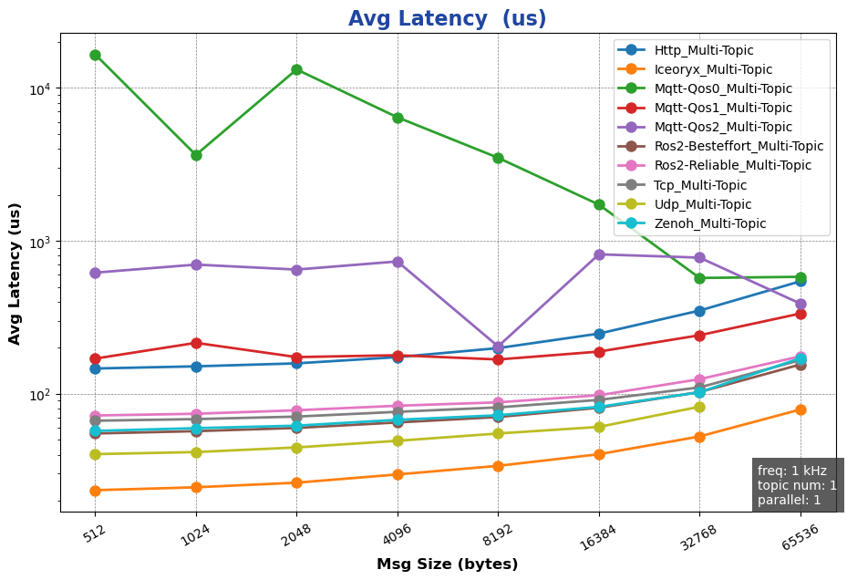
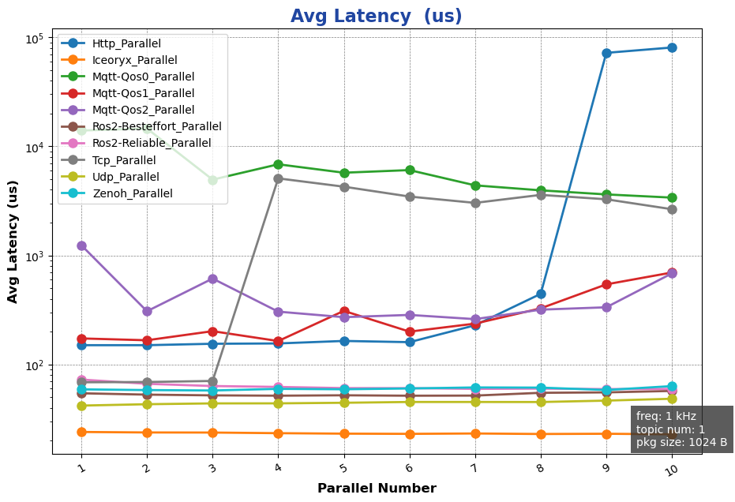
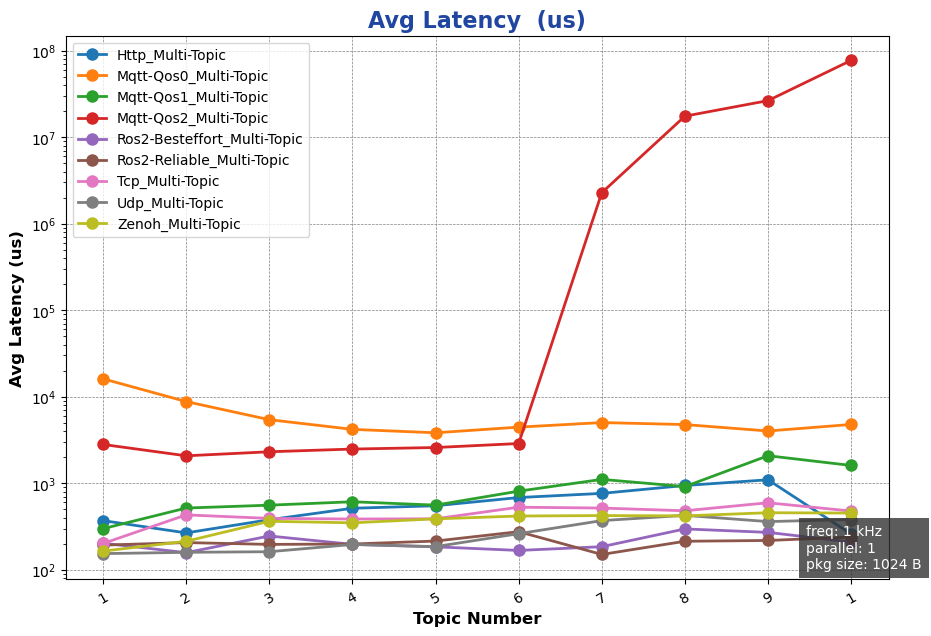
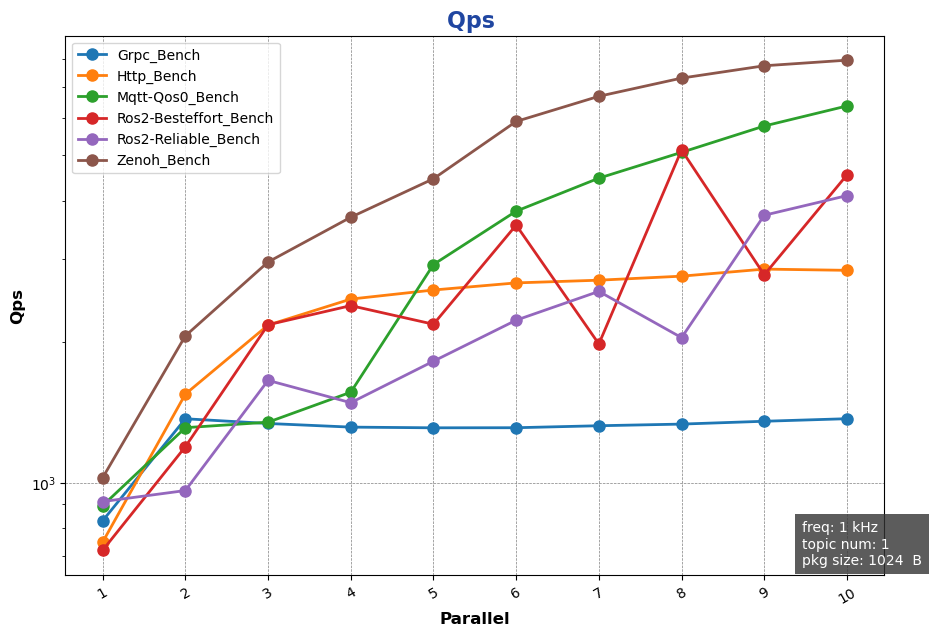

<table style="width: 100%; color: gray; font-size: 14px;">
<tr>
<td style="text-align: left;">NOTE: following tests were done in Mar. 2025, which may not reflect latest status of the package.</td>
</tr>
</table>

# AimRT 0.10.0-py &nbsp;Performance Test Report

## Preface
The communication layer of AimRT is implemented through plugins. Officially supported plugins include iceoryx, ROS2, Zenoh, Http, Grpc, Mqtt, etc., covering common edge and cloud communication scenarios. These plugins provide two common communication patterns: `publish-subscribe` and `request-response`, enabling `intra-host` and `cross-host` multiprocess communication.

## Test Environment
- System Environment:
  - OS: 
  - CPU: 13th Gen Intel(R) Core(TM) i5-1350P
  - Linux 6.1.59-rt16

- Software Environment
  - AimRT Version: 0.10.0

## Test Items

Using AimRT-py for testing, test items include:
- Single-host Performance Tests
  - Channel Backend Performance
    - [Impact of Package Size](#impact-of-package-size)
    - [Impact of Topic Quantity](#impact-of-topic-quantity)
    - [Impact of Parallelism Level](#impact-of-parallelism-level)
  - Rpc Backend Performance
    - [Package Size Impact in bench Mode](#package-size-impact-in-bench-mode)
    - [Package Size Impact in fixed_freq Mode](#package-size-impact-in-fixed_freq-mode)
    - [Parallelism Impact in bench Mode](#parallelism-impact-in-bench-mode)
    - [Parallelism Impact in fixed_freq Mode](#parallelism-impact-in-fixed_freq-mode)
- Cross-host Performance Tests
  - Channel Backend Performance
    - [Impact of Package Size](#impact-of-package-size-1)
    - [Impact of Topic Quantity](#impact-of-topic-quantity-1)
    - [Impact of Parallelism Level](#impact-of-parallelism-level-1)
  - Rpc Backend Performance
    - [Package Size Impact in bench Mode](#package-size-impact-in-bench-mode-1)
    - [Package Size Impact in fixed_freq Mode](#package-size-impact-in-fixed_freq-mode-1)
    - [Parallelism Impact in bench Mode](#parallelism-impact-in-bench-mode-1)
    - [Parallelism Impact in fixed_freq Mode](#parallelism-impact-in-fixed_freq-mode-1)

## Test Results

### Single-host Performance Tests (X86)

#### Channel Backend Performance
##### Impact of Package Size:
- Purpose: Test cross-process Channel backend performance with different `package sizes` on single host
- Configuration:
  - channel_frequency: 1 kHz
  - pkg_size: 256 B ~ 64 KB (2^8 ~ 2^16, exponential increments)
  - topic_number: 1 
  - parallel_number=1
- Results:
  

##### Impact of Topic Quantity:
- Purpose: Test cross-process Channel backend performance with different `topic quantities` on single host
- Configuration:
  - channel_frequency: 1 kHz
  - pkg_size: 1024 B
  - topic_number: 1 ~ 10 
  - parallel_number=1
- Results:

##### Impact of Parallelism Level:
- Purpose: Test cross-process Channel backend performance with different `parallelism levels` on single host
- Configuration:
  - channel_frequency: 1 kHz
  - pkg_size: 1024 B
  - topic_number: 1 
  - parallel_number=1 ~ 10
- Results:
  

{{ '[Detailed Data]({}/document/sphinx-cn/tutorials/misc/performance_test/0.10.0/py/data/local_chn_data.csv)'.format(code_site_root_path_url) }}

#### Rpc Backend Performance

##### Package Size Impact in bench Mode:
- Purpose: Test cross-process Rpc backend performance with different `package sizes` in bench mode on single host
- Configuration:
  - mode: bench
  - channel_frequency: 1 kHz
  - pkg_size: 256 B ~ 64 KB (2^8 ~ 2^16, exponential increments)
  - paraller_number: 1
- Results:
  

##### Package Size Impact in fixed-freq Mode:
- Purpose: Test cross-process Rpc backend performance with different `package sizes` in fixed-freq mode on single host
- Configuration:
  - mode: fixed-freq
  - channel_frequency: 1 kHz
  - pkg_size: 256 B ~ 64 KB (2^8 ~ 2^16, exponential increments)
  - paraller_number: 1
- Results:
  

##### Parallelism Impact in bench Mode:
- Purpose: Test cross-process Rpc backend performance with different `parallelism levels` in bench mode on single host
- Configuration:
  - mode: bench
  - channel_frequency: 1 kHz
  - pkg_size: 1024 B  
  - paraller_number: 1 ~ 10
- Results:

##### Parallelism Impact in fixed-freq Mode:
- Purpose: Test cross-process Rpc backend performance with different `parallelism levels` in fixed-freq mode on single host
- Configuration:  
  - mode: fixed-freq
  - channel_frequency: 1 kHz
  - pkg_size: 1024 B  
  - paraller_number: 1 ~ 10
- Results:

{{ '[Detailed Data]({}/document/sphinx-cn/tutorials/misc/performance_test/0.10.0/py/data/local_rpc_data.csv)'.format(code_site_root_path_url) }}

### Cross-host Performance Tests
#### Channel Backend Performance
##### Impact of Package Size:
- Purpose: Test cross-host Channel backend performance with different `package sizes`
- Configuration:
  - channel_frequency: 1 kHz
  - pkg_size: 256 B ~ 64 KB (2^8 ~ 2^16, exponential increments)
  - topic_number: 1 
  - parallel_number=1
- Results:

##### Impact of Topic Quantity:
- Purpose: Test cross-host Channel backend performance with different `topic quantities`
- Configuration:
  - channel_frequency: 1 kHz
  - pkg_size: 1024 B
  - topic_number: 1 ~ 10 
  - parallel_number=1
- Results:

##### Impact of Parallelism Level:
- Purpose: Test cross-host Channel backend performance with different `parallelism levels`
- Configuration:
  - channel_frequency: 1 kHz
  - pkg_size: 1024 B
  - topic_number: 1 
  - parallel_number=1 ~ 10
- Results:
  

{{ '[Detailed Data]({}/document/sphinx-cn/tutorials/misc/performance_test/0.10.0/py/data/cross-machine_chn_data.csv)'.format(code_site_root_path_url) }}

#### Rpc Backend Performance

##### Package Size Impact in bench Mode:
- Purpose: Test cross-host Rpc backend performance with different `package sizes` in bench mode
- Configuration:
  - mode: bench
  - channel_frequency: 1 kHz
  - pkg_size: 256 B ~ 64 KB (2^8 ~ 2^16, exponential increments)
  - paraller_number: 1
- Results:

##### Package Size Impact in fixed-freq Mode:
- Purpose: Test cross-host Rpc backend performance with different `package sizes` in fixed-freq mode
- Configuration:
  - mode: fixed-freq
  - channel_frequency: 1 kHz
  - pkg_size: 256 B ~ 64 KB (2^8 ~ 2^16, exponential increments)
  - paraller_number: 1
- Results:

##### Parallelism Impact in bench Mode:
- Purpose: Test cross-host Rpc backend performance with different `parallelism levels` in bench mode
- Configuration:
  - mode: bench
  - channel_frequency: 1 kHz
  - pkg_size: 1024 B  
  - paraller_number: 1 ~ 10
- Results:

##### Parallelism Impact in fixed-freq Mode:
- Purpose: Test cross-host Rpc backend performance with different `parallelism levels` in fixed-freq mode
- Configuration:  
  - mode: fixed-freq
  - channel_frequency: 1 kHz
  - pkg_size: 1024 B  
  - paraller_number: 1 ~ 10
- Results:

{{ '[Detailed Data]({}/document/sphinx-cn/tutorials/misc/performance_test/0.10.0/py/data/cross-machine_rpc_data.csv)'.format(code_site_root_path_url) }}