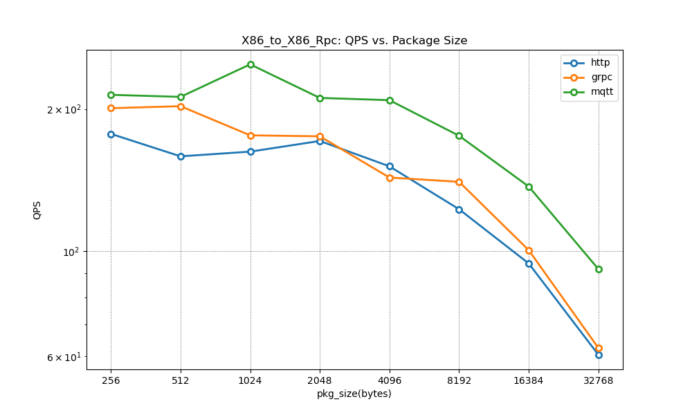

# AimRT 0.8.0 Performance Testing

## Preface
The communication layer of AimRT is implemented through plugins, with official support for communication plugins such as iceoryx, ROS2, Zenoh, Http, Grpc, and Mqtt, covering common edge and cloud communication scenarios. These plugins provide two common communication modes: publish-subscribe (Channel) and request-response (Rpc) for both local and cross-machine inter-process communication.

This document conducts performance tests on various core components officially provided by AimRT. Please note that test results are influenced by external factors such as testing platforms and networks, and are only intended to demonstrate relative performance.

## Test Items
- Single-machine performance testing
  - Log performance testing
  - Channel backend performance testing
  - Rpc backend performance testing
- Multi-machine performance testing
  - Channel backend performance testing
  - Rpc backend performance testing

## Test Environment
| Architecture | Operating System | System Architecture |                        CPU                        |
| :----------: | :--------------: | :-----------------: | :-----------------------------------------------: |
| Host 1       | GNU/Linux        | x86_64              | 13th Gen Intel(R) Core(TM) i5-1350P   - CPU(s):16 |
| Host 2       | GNU/Linux        | x86_64              | 13th Gen Intel(R) Core(TM) i5-1350P   - CPU(s):16 |

## Test Results### Standalone Performance Testing

#### Logger Performance Testing
- Test Items:
  - Test Environment: Host 1·x86 
  - Test Objective: Log printing performance test (Average latency VS log size)
  - Test Results:
  
| Log Data Size (bytes) | 32  | 64  | 128 | 256 | 512 | 1024 | 2048 | 4096 | 8192 |
| --------------------- | --- | --- | --- | --- | --- | ---- | ---- | ---- | ---- |
| **Avg Latency(ns)**   | 235 | 735 | 393 | 568 | 819 | 839  | 4352 | 4407 | 4362 |

#### Channel Backend Performance Testing
- Test Item 1:
  - Test Environment: Host 1·x86 (3 cores)
  - Test Objective: Cross-process Channel backend communication test on a single machine (Average latency VS packet size)
  - Test Configuration: channel_frequency=1 kHz, topic_number=1
  - Test Results:
  
  
  

- Test Item 2:
  - Test Environment: Host 1·x86 (3 cores)
  - Test Objective: Cross-process Channel backend communication test on a single machine (Average latency VS topic count)
  - Test Configuration: channel_frequency=1 kHz, pkg_size=1 k bytes
  - Test Results:
  
   

- Summary:
  
| ID  | Backend Type | Pkg Size <br>(bytes) | Topic num | Avg Latency<br> (us) | Max Latency <br>(us) | Loss Rate<br> (%) | Avg CPU Usage<br> (%) |
| --- | ------------ | :------------------: | :-------: | :------------------: | :------------------: | :---------------: | :-------------------: |
| 1   | iceoryx      |         512          |     1     |        33.78         |       556.791        |         0         |        0.8/0.1        |
| 2   | ros2         |         512          |     1     |        78.294        |        601.76        |         0         |        3.1/1.2        |
| 3   | zenoh        |         512          |     1     |        86.67         |       3479.172       |         0         |        0.9/0.3        |
| 4   | iceoryx      |         2048         |     1     |        33.755        |       368.843        |         0         |        0.9/0.3        |
| 5   | ros2         |         2048         |     1     |        78.294        |        601.76        |         0         |        3.5/3.3        |
| 6   | zenoh        |         2048         |     1     |        89.812        |       2265.741       |         0         |        1.3/1.4        |
| 7   | iceoryx      |         8192         |     1     |        35.327        |       372.595        |         0         |        1.0/0.4        |
| 8   | ros2         |         8192         |     1     |        91.106        |       898.042        |         0         |        3.6/4.2        |
| 9   | zenoh        |         8192         |     1     |        90.438        |       1222.726       |         0         |       2.0 /1.5        |
| 10  | iceoryx      |         1024         |     1     |        33.108        |        325.33        |         0         |       0.9 /0.8        |
| 11  | ros2         |         1024         |     1     |        83.337        |       1223.164       |         0         |        3.4/3.2        |
| 12  | zenoh        |         1024         |     1     |        88.695        |       1208.31        |         0         |        1.7/1.4        |
| 13  | iceoryx      |         1024         |     4     |        23.417        |       458.296        |         0         |        1.5/1.5        |
| 14  | ros2         |         1024         |     4     |        89.216        |       1965.28        |         0         |       4.4/ 11.7       |
| 15  | zenoh        |         1024         |     4     |       6243.743       |      12750.598       |         0         |        2.5/1.6        |
| 16  | iceoryx      |         1024         |     8     |        19.884        |       320.847        |         0         |        2.8/2.1        |
| 17  | ros2         |         1024         |     8     |        70.075        |       3913.944       |         0         |       7.5/13.6        |
| 18  | zenoh        |         1024         |     8     |       3237.104       |       6913.596       |         0         |       3.0 /1.8        |

#### Rpc Backend Performance Testing
- Test Item 1:
  - Test Environment: Host 1·x86 (3 cores)
  - Test Objective: Cross-process Rpc backend communication test on a single machine (Average latency VS data packet size)
  - Test Configuration: paraller_number=1 
  - Test Results:```markdown


- Test Item 2:
  - Test Environment: Host 1·x86 (3 cores)
  - Test Objective: Single-machine cross-process RPC backend communication test (QPS vs. Packet Size)
  - Test Configuration: paraller_number=1 
  - Test Results:

   

- Test Item 3:
  - Test Environment: Host 1·x86 (3 cores)
  - Test Objective: Single-machine cross-process RPC backend communication test (Average Latency vs. Parallelism)
  - Test Configuration: Rpc_frequency=1 kHz, pkg_size=1 k bytes
  - Test Results:

   
  

- Summary:

**Stress Test Mode**

| ID  | Backend Type | Pkg Size <br>(bytes) | Topic num | Avg Latency<br> (us) | Max Latency <br>(us) |   QPS    | Error Rate<br> (%) | Avg CPU Usage<br> (%) |
| --- | ------------ | :------------------: | :-------: | :------------------: | :------------------: | :------: | :----------------: | :-------------------: |
| 1   | grpc         |         512          |     1     |       102.385        |       1015.132       | 5668.934 |         0          |       11.2/6.6        |
| 2   | http         |         512          |     1     |       137.783        |       646.192        | 7032.348 |         0          |       33.9/6.9        |
| 3   | ros2         |         512          |     1     |       710.772        |       787.366        | 784.190  |         0          |       23.1/4.1        |
| 4   | mqtt         |         512          |     1     |       227.804        |      99936.432       | 4295.532 |         0          |       13.4/2.3        |
| 5   | grpc         |         2048         |     1     |       172.007        |       846.916        | 5662.514 |         0          |       21.4/4.4        |
| 6   | http         |         2048         |     1     |       137.435        |       620.138        | 7062.146 |         0          |       47.5/14.8       |
| 7   | ros2         |         2048         |     1     |        72.425        |       687.575        | 783.330  |         0          |       28.4/7.7        |
| 8   | mqtt         |         2048         |     1     |       243.326        |      100343.387      | 4022.526 |         0          |       18.6/6.1        |


**Fixed Frequency Mode**
| ID  | Backend Type | Pkg Size <br>(bytes) | Topic num | Avg Latency<br> (us) | Max Latency <br>(us) | Error Rate<br> (%) | Avg CPU Usage<br> (%) |
| --- | ------------ | :------------------: | :-------: | :------------------: | :------------------: | :----------------: | :-------------------: |
| 1   | grpc         |         1024         |     1     |       274.102        |       1135.26        |         0          |       28.7/7.3        |
| 2   | http         |         1024         |     1     |       253.347        |       916.773        |         0          |       44.3/16.8       |
| 3   | ros2         |         1024         |     1     |        93.259        |       1081.053       |         0          |       27.3/6.2        |
| 4   | mqtt         |         1024         |     1     |       399.444        |      100581.09       |         0          |       17.5/11.1       |
| 5   | grpc         |         1024         |     4     |       326.857        |       3131.102       |         0          |       19.8/12.6       |
| 6   | http         |         1024         |     4     |       272.115        |       1713.79        |         0          |       46.3/26.3       |
| 7   | ros2         |         1024         |     4     |       112.685        |       2050.94        |         0          |       40.6/19.6       |
| 8   | mqtt         |         1024         |     4     |       681.431        |      99994.365       |         0          |       26.0/14.0       |
| 9   | grpc         |         1024         |     8     |       830.776        |       4318.728       |         0          |       31.1/16.6       |
| 10  | http         |         1024         |     8     |       215.188        |       3961.397       |         0          |       51.2/29.9       |
```| 11  | ros2         |         1024         |     8     |       149.772        |       3380.315       |         0          |       41.1/20.2       |
| 12  | mqtt         |         1024         |     8     |       755.568        |      98599.196       |         0          |       28.8/15.2       |### Multi-Machine Performance Testing

#### Host1 to Host2 Channel Backend Performance Testing

- Test Item 1:
  - Test Environment: Host1·x86 (3 cores), Host2·x86 (3 cores)
  - Test Objective: Cross-machine cross-process Channel backend communication test (Average Latency VS Packet Size)
  - Test Configuration: channel_frequency=1 kHz, topic_number=1
  - Test Result:

   

- Test Item 2:
  - Test Environment: Host1·x86 (3 cores), Host2·x86 (3 cores)
  - Test Objective: Cross-machine cross-process Channel backend communication test (Average Latency VS Topic Number)
  - Test Configuration: channel_frequency=1 kHz, pkg_size=1 k bytes
  - Test Result:
  
   

- Summary:
  
| ID  | Backend Type | Pkg Size <br>(bytes) | Topic num | Avg Latency<br> (us) | Max Latency <br>(us) | Loss Rate<br> (%) |
| --- | ------------ | :------------------: | :-------: | :------------------: | :------------------: | :---------------: |
| 1   | mqtt         |         512          |     1     |       9436.628       |     1922348.666      |         0         |
| 2   | zenoh        |         512          |     1     |       9749.743       |      225513.208      |         0         |
| 3   | mqtt         |         2048         |     1     |      21715.483       |      87612.922       |         0         |
| 4   | zenoh        |         2048         |     1     |      15313.238       |      130844.909      |         0         |
| 5   | mqtt         |         8192         |     1     |     1728639.372      |     4060503.312      |         0         |
| 6   | zenoh        |         8192         |     1     |      67700.703       |       84407.91       |         0         |
| 7   | mqtt         |         1024         |     1     |       30003.15       |      143020.411      |         0         |
| 8   | zenoh        |         1024         |     1     |      12590.826       |      78070.239       |         0         |
| 9   | mqtt         |         1024         |     4     |      10815.251       |      109914.215      |         0         |
| 10  | zenoh        |         1024         |     4     |      13537.918       |      98343.269       |         0         |
| 11  | mqtt         |         1024         |     8     |     2281671.772      |     4289304.104      |         0         |
| 12  | zenoh        |         1024         |     8     |      262563.641      |      449324.47       |         0         |

#### Host1 to Host2 Rpc Backend Performance Testing

- Test Item 1:
  - Test Environment: Host1·x86 (3 cores), Host2·x86 (3 cores)
  - Test Objective: x86_to_X86 cross-machine cross-process Rpc backend communication test (Average Latency VS Packet Size)
  - Test Configuration: paraller_number=1 
  - Test Result:
  
   

- Test Item 2:
  - Test Environment: Host1·x86 (3 cores), Host2·x86 (3 cores)
  - Test Objective: x86_to_X86 cross-machine cross-process Rpc backend communication test (QPS VS Packet Size)
  - Test Configuration: paraller_number=1 
  - Test Result:

   

- Test Item 3:
  - Test Environment: Host1·x86 (3 cores), Host2·x86 (3 cores)
  - Test Objective: x86_to_X86 cross-machine cross-process Rpc backend communication test (Average Latency VS Parallel Number)
  - Test Configuration: Rpc_frequency=1 kHz, pkg_size=1 k bytes
  - Test Result:

   


- Summary:
  
**Stress Testing Mode**

| ID  | Backend Type | Pkg Size <br>(bytes) | Topic num | Avg Latency<br> (us) | Max Latency <br>(us) |   QPS   | Error Rate<br> (%) |
| --- | ------------ | :------------------: | :-------: | :------------------: | :------------------: | :-----: | :----------------: |
| 1   | grpc         |         512          |     1     |       4924.824       |      322766.91       | 202.741 |         0          |
| 2   | http         |         512          |     1     |       6284.018       |      324016.359      | 158.825 |         0          |
| 3   | mqtt         |         512          |     1     |       4702.392       |      320198.678      | 212.116 |         0          |
| 4   | grpc         |         2048         |     1     |       5704.31        |      403065.412      | 175.082 |         0          || 5   | http         |         2048         |     1     |       5830.839       |      222680.914      | 171.156 |         0          |
| 6   | mqtt         |         2048         |     1     |       4726.14        |      321514.163      | 211.041 |         0          |
| 7   | grpc         |         8192         |     1     |       7120.05        |      315765.656      | 140.295 |         0          |
| 8   | http         |         8192         |     1     |       8134.13        |      335106.68       | 122.756 |         0          |
| 9   | mqtt         |         8192         |     1     |       5684.013       |      165831.057      | 175.530 |         0          |

**Fixed Frequency Mode**

| ID  | Backend Type | Pkg Size <br>(bytes) | Topic num | Avg Latency<br> (us) | Max Latency <br>(us) | Error Rate<br> (%) |
| --- | ------------ | :------------------: | :-------: | :------------------: | :------------------: | :----------------: |
| 1   | grpc         |         1024         |     1     |       3800.001       |      83298.271       |         0          |
| 2   | http         |         1024         |     1     |       4906.788       |      238306.281      |         0          |
| 3   | mqtt         |         1024         |     1     |       3979.662       |      117279.111      |         0          |
| 4   | grpc         |         1024         |     4     |       6329.525       |      315825.548      |         0          |
| 5   | http         |         1024         |     4     |       9002.289       |      614524.388      |         0          |
| 6   | mqtt         |         1024         |     4     |      12371.313       |      327013.301      |         0          |
| 7   | grpc         |         1024         |     8     |       7574.52        |      881297.081      |         0          |
| 8   | http         |         1024         |     8     |       8278.314       |      904195.888      |         0          |
| 9   | mqtt         |         1024         |     8     |      11336.935       |      324605.52       |         0          |