<table style="width: 100%; color: gray; font-size: 14px;">
<tr>
<td style="text-align: left;">NOTE: following tests were done in May. 2025, which may not reflect latest status of the package.</td>
</tr>
</table>

# AimRT 1.0.0-cpp &nbsp;Performance Test Report

## Preface

AimRT's communication layer is implemented through plugins, with official support for Iceoryx, ROS2, Zenoh, Net, Grpc, Mqtt and other plugins as communication backends, covering common edge and cloud communication scenarios. These plugins provide two common communication modes: `Publish-Subscribe (Channel)` and `Request-Response (Rpc)` to achieve `intra-machine` and `cross-machine` multi-process communication.

## Test Environment

- System Environment:
  - OS: 6.1.59-rt16 x86_64 GNU/Linux
  - CPU: 13th Gen Intel(R) Core(TM) i5-1350P
  - Total Memory/Available Memory: 62Gi / 38Gi

- Software Environment:
  - AimRT Version: 1.0.0

## Test Items

Testing was conducted using AimRT-cpp with the following test items:

- Single-machine Performance Tests
  - Channel Backend Performance Tests
    - Impact of packet size on performance in multi-topic mode
    - Impact of topic count on performance in multi-topic mode
    - Impact of packet size on performance in parallel mode
    - Impact of concurrency count on performance in parallel mode
  - Rpc Backend Performance Tests
    - Impact of packet size on performance in bench mode
    - Impact of concurrency count on performance in bench mode
    - Impact of packet size on performance in fixed_freq mode
    - Impact of concurrency count on performance in fixed_freq mode
- Cross-machine Performance Tests
  - Channel Backend Performance Tests
    - Impact of packet size on performance in multi-topic mode
    - Impact of topic count on performance in multi-topic mode
    - Impact of packet size on performance in parallel mode
    - Impact of concurrency count on performance in parallel mode
  - Rpc Backend Performance Tests
    - Impact of packet size on performance in bench mode
    - Impact of concurrency count on performance in bench mode
    - Impact of packet size on performance in fixed_freq mode
    - Impact of concurrency count on performance in fixed_freq mode

## Test Results

### Single-machine Performance Tests (X86)

#### Channel Backend Performance Tests

##### Impact of packet size on performance in multi-topic mode:

- Test Objective: Performance test of single-machine cross-process Channel backend in multi-topic mode with different `packet sizes`
- Test Configuration:
  - channel_frequency: 1 kHz
  - pkg_size: 256 B ~ 64 KB (2^8 ~ 2^16, increasing by powers of 2)
  - topic_number: 1
  - parallel_number=1
- Test Results:

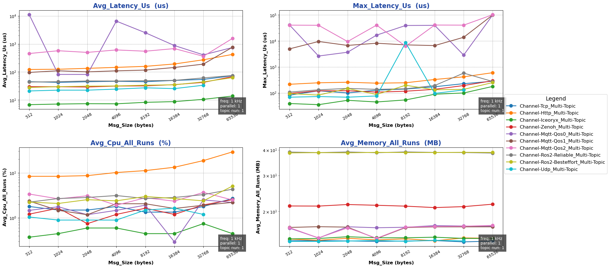

##### Impact of topic count on performance in multi-topic mode:

- Test Objective: Performance test of single-machine cross-process Channel backend in multi-topic mode with different `topic counts`
- Test Configuration:
  - channel_frequency: 1 kHz
  - pkg_size: 1024 B
  - topic_number: 1 ~ 10
  - parallel_number=1
- Test Results:

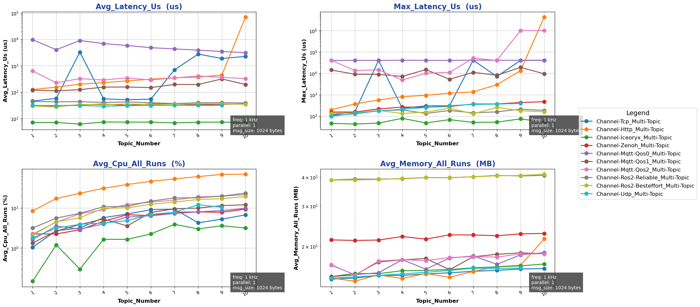

##### Impact of packet size on performance in parallel mode:

- Test Objective: Performance test of single-machine cross-process Channel backend in parallel mode with different `packet sizes`
- Test Configuration:
  - channel_frequency: 1 kHz
  - pkg_size: 1024 B
  - topic_number: 1
  - parallel_number=1 ~ 10
- Test Results:

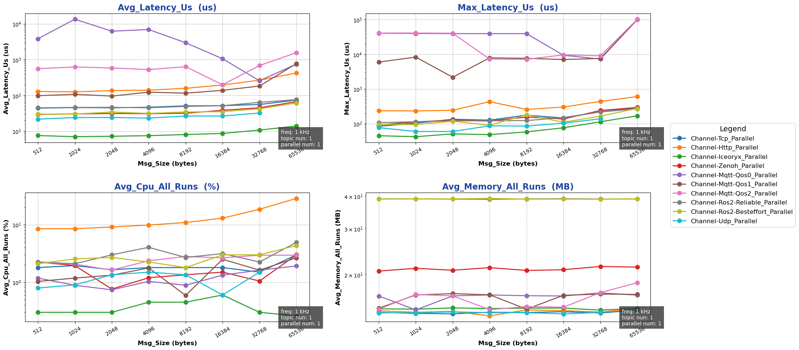

##### Impact of concurrency count on performance in parallel mode:

- Test Objective: Performance test of single-machine cross-process Channel backend in parallel mode with different `concurrency counts`
- Test Configuration:
  - channel_frequency: 1 kHz
  - pkg_size: 1024 B
  - topic_number: 1
  - parallel_number=1 ~ 10
- Test Results:

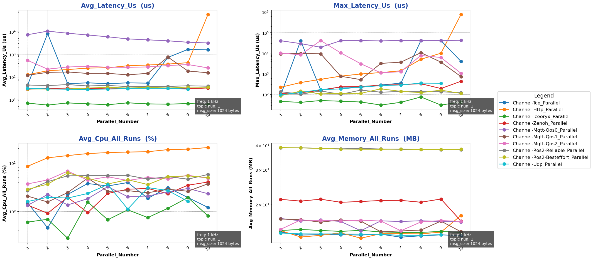

{{ '[Detailed Data]({}/document/sphinx-cn/tutorials/misc/performance_test/1.0.0/cpp/data/result_channel_local_cpp.csv)'.format(code_site_root_path_url) }}

#### Rpc Backend Performance Tests

##### Impact of packet size on performance in bench mode:

- Test Objective: Performance test of single-machine cross-process Rpc backend in bench mode with different `packet sizes`
- Test Configuration:
  - mode: bench
  - channel_frequency: 1 kHz
  - pkg_size: 256 B ~ 64 KB (2^8 ~ 2^16, increasing by powers of 2)
  - paraller_number: 1
- Test Results:

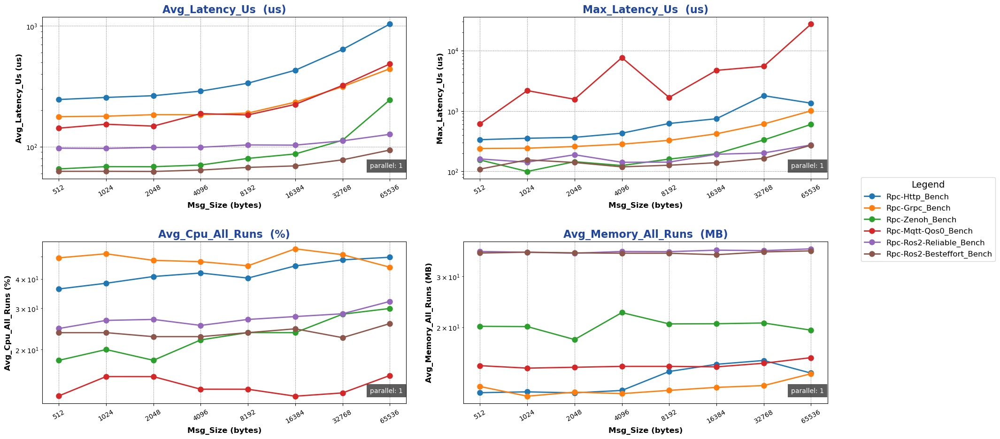

##### Impact of concurrency count on performance in bench mode:

- Test Objective: Performance test of single-machine cross-process Rpc backend in bench mode with different `concurrency counts`
- Test Configuration:
  - mode: bench
  - channel_frequency: 1 kHz
  - pkg_size: 1024 B
  - paraller_number: 1 ~ 10
- Test Results:

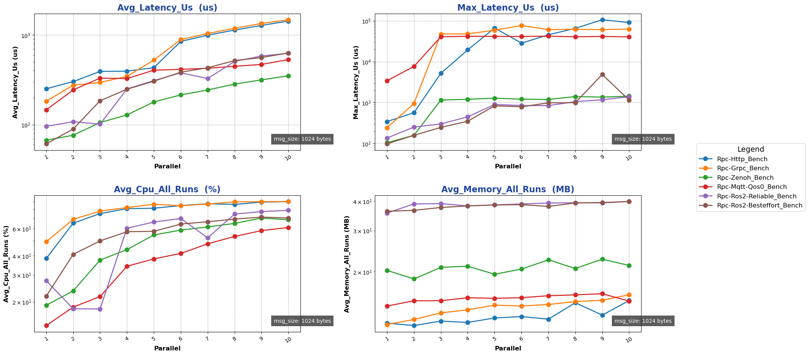

##### Impact of packet size on performance in fixed-freq mode:

- Test Objective: Performance test of single-machine cross-process Rpc backend in fixed-freq mode with different `packet sizes`
- Test Configuration:
  - mode: fixed-freq
  - channel_frequency: 1 kHz
  - pkg_size: 256 B ~ 64 KB (2^8 ~ 2^16, increasing by powers of 2)
  - paraller_number: 1
- Test Results:

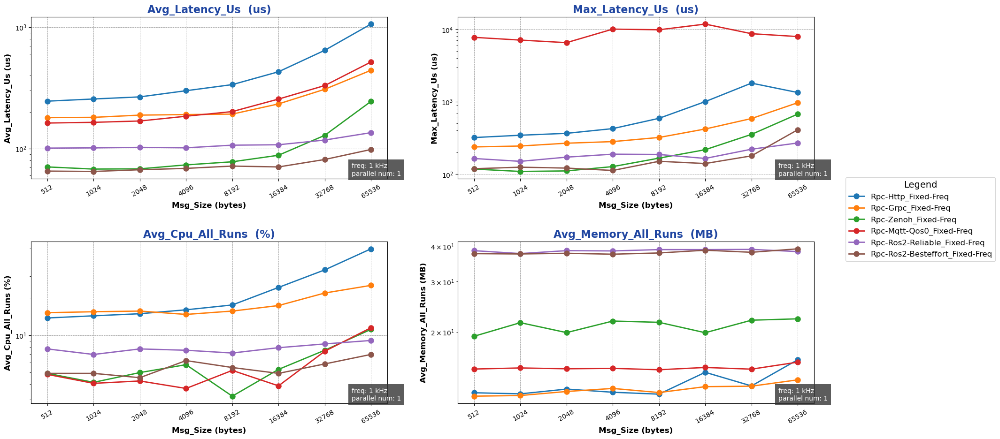

##### Impact of concurrency count on performance in fixed-freq mode:

- Test Objective: Performance test of single-machine cross-process Rpc backend in fixed-freq mode with different `concurrency counts`
- Test Configuration:
  - mode: fixed-freq
  - channel_frequency: 1 kHz
  - pkg_size: 1024 B
  - paraller_number: 1 ~ 10
- Test Results:

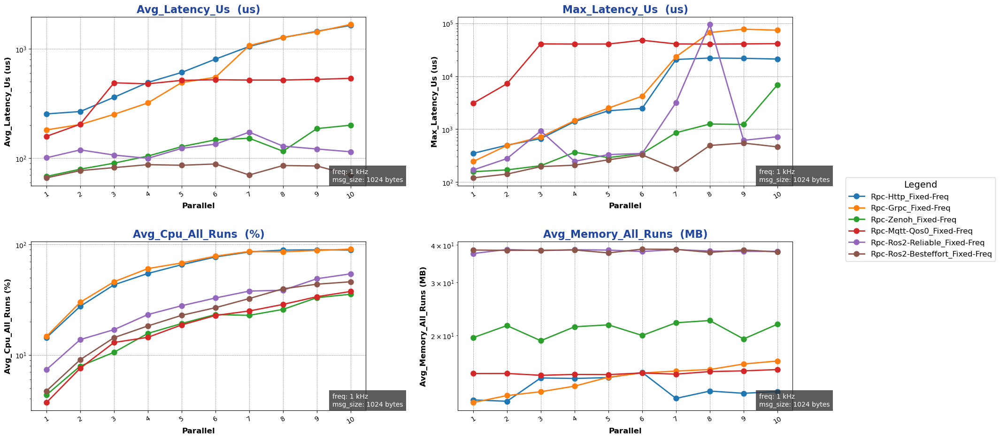

{{ '[Detailed Data]({}/document/sphinx-cn/tutorials/misc/performance_test/1.0.0/cpp/data/result_rpc_local_cpp.csv)'.format(code_site_root_path_url) }}

### Cross-machine Performance Tests

#### Channel Backend Performance Tests

##### Impact of packet size on performance in multi-topic mode:

- Test Objective: Performance test of cross-machine Channel backend in multi-topic mode with different `packet sizes`
- Test Configuration:
  - channel_frequency: 1 kHz
  - pkg_size: 256 B ~ 64 KB (2^8 ~ 2^16, increasing by powers of 2)
  - topic_number: 1
  - parallel_number=1
- Test Results:

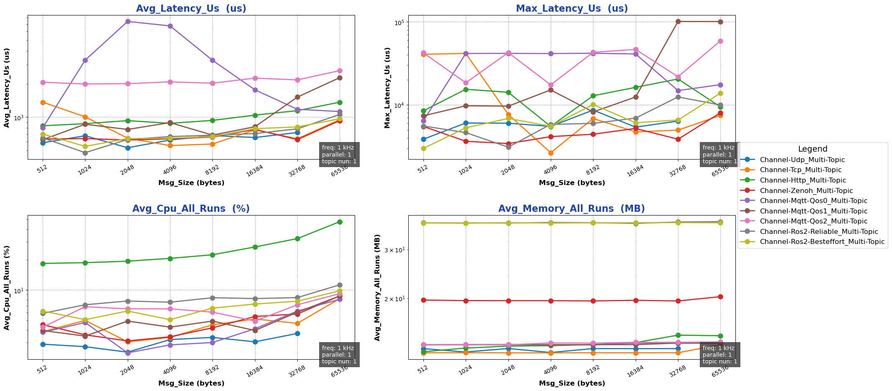

##### Impact of topic count on performance in multi-topic mode:

- Test Objective: Performance test of cross-machine Channel backend in multi-topic mode with different `topic counts`
- Test Configuration:
  - channel_frequency: 1 kHz
  - pkg_size: 1024 B
  - topic_number: 1 ~ 10
  - parallel_number=1
- Test Results:

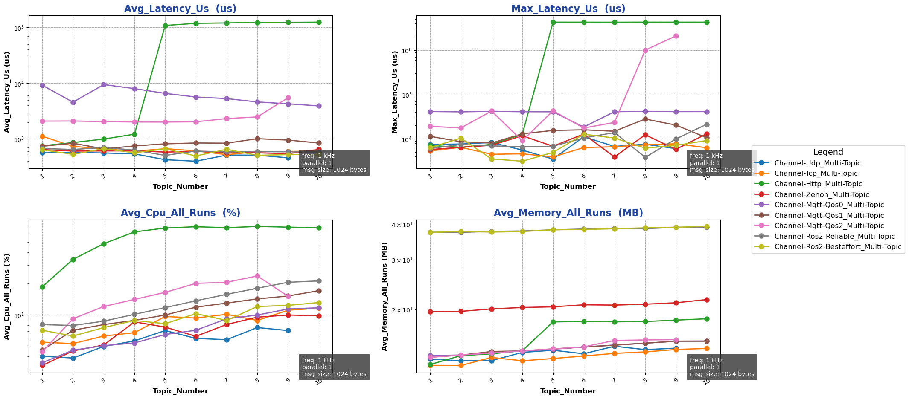

##### Impact of packet size on performance in parallel mode:

- Test Objective: Performance test of cross-machine Channel backend in parallel mode with different `packet sizes`
- Test Configuration:
  - channel_frequency: 1 kHz
  - pkg_size: 1024 B
  - topic_number: 1
  - parallel_number=1 ~ 10
- Test Results:

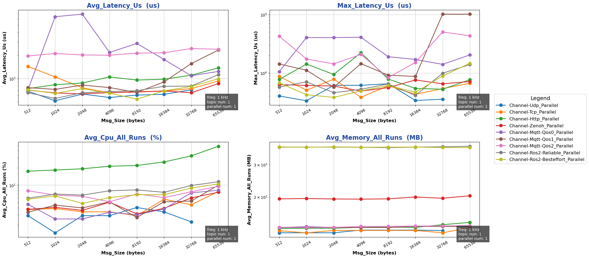

##### Impact of concurrency count on performance in parallel mode:

- Test Objective: Performance test of cross-machine Channel backend in parallel mode with different `concurrency counts`
- Test Configuration:
  - channel_frequency: 1 kHz
  - pkg_size: 1024 B
  - topic_number: 1
  - parallel_number=1 ~ 10
- Test Results:

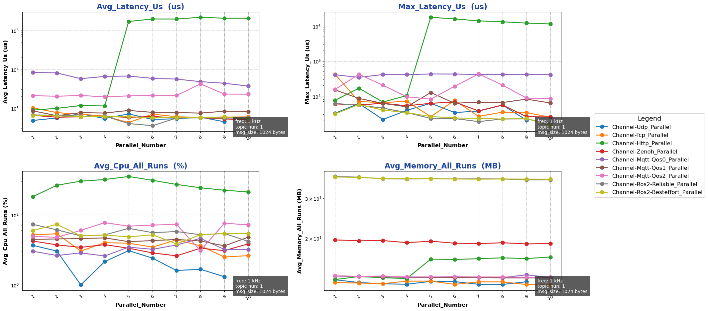

{{ '[Detailed Data]({}/document/sphinx-cn/tutorials/misc/performance_test/1.0.0/cpp/data/result_channel_cross_cpp.csv)'.format(code_site_root_path_url) }}

#### Rpc Backend Performance Tests

##### Impact of packet size on performance in bench mode:

- Test Objective: Performance test of cross-machine Rpc backend in bench mode with different `packet sizes`
- Test Configuration:
  - mode: bench
  - channel_frequency: 1 kHz
  - pkg_size: 256 B ~ 64 KB (2^8 ~ 2^16, increasing by powers of 2)
  - paraller_number: 1
- Test Results:

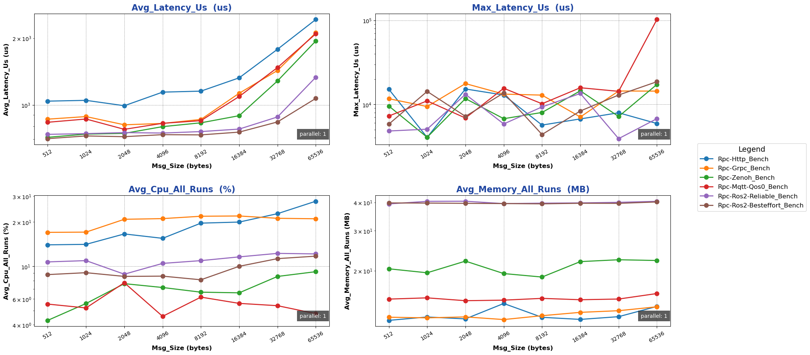

##### Impact of concurrency count on performance in bench mode:

- Test Objective: Performance test of cross-machine Rpc backend in bench mode with different `concurrency counts`
- Test Configuration:
  - mode: bench
  - channel_frequency: 1 kHz
  - pkg_size: 1024 B
  - paraller_number: 1 ~ 10
- Test Results:

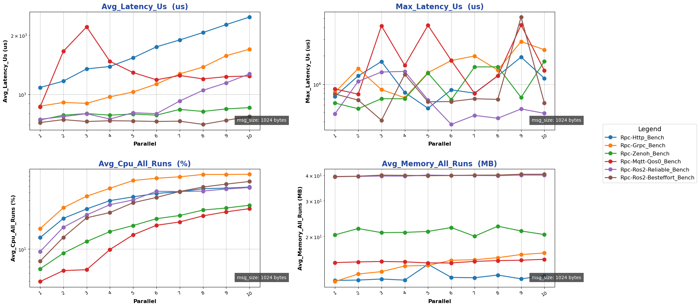

##### Impact of packet size on performance in fixed-freq mode:

- Test Objective: Performance test of cross-machine Rpc backend in fixed-freq mode with different `packet sizes`
- Test Configuration:
  - mode: fixed-freq
  - channel_frequency: 1 kHz
  - pkg_size: 256 B ~ 64 KB (2^8 ~ 2^16, increasing by powers of 2)
  - paraller_number: 1
- Test Results:

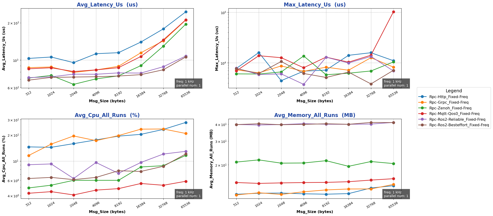

##### Impact of concurrency count on performance in fixed-freq mode:

- Test Objective: Performance test of cross-machine Rpc backend in fixed-freq mode with different `concurrency counts`
- Test Configuration:
  - mode: fixed-freq
  - channel_frequency: 1 kHz
  - pkg_size: 1024 B
  - paraller_number: 1 ~ 10
- Test Results:

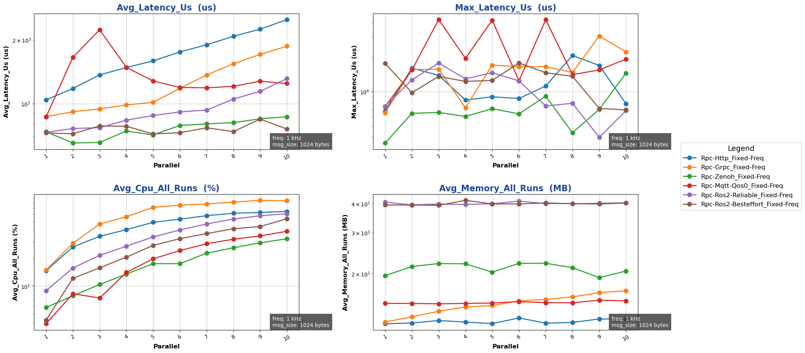

{{ '[Detailed Data]({}/document/sphinx-cn/tutorials/misc/performance_test/1.0.0/cpp/data/result_rpc_cross_cpp.csv)'.format(code_site_root_path_url) }}