<table style="width: 100%; color: gray; font-size: 14px;">
<tr>
<td style="text-align: left;">NOTE: following tests were done in May. 2025, which may not reflect latest status of the package.</td>
</tr>
</table>

# AimRT 1.0.0-py &nbsp;Performance Test Report

## Preface

AimRT's communication layer is implemented via plugins. The officially supported backends include Iceoryx, ROS2, Zenoh, Net, Grpc, Mqtt, etc., covering common edge and cloud communication scenarios. These plugins provide the two common communication patterns of `publish-subscribe (Channel)` and `request-response (Rpc)` to enable multi-process communication both `locally` and `across machines`.

## Test Environment

- System Environment:

  - OS: 6.1.59-rt16 x86_64 GNU/Linux
  - CPU: 13th Gen Intel(R) Core(TM) i5-1350P
  - Total / Available Memory: 62 Gi / 38 Gi

- Software Environment:
  - AimRT Version: 1.0.0

## Test Items

Tests were conducted using AimRT-py. The test items are as follows:

- Single-machine performance test
  - Channel backend performance test
    - Impact of packet size in multi-topic mode
    - Impact of topic count in multi-topic mode
    - Impact of packet size in parallel mode
    - Impact of concurrency in parallel mode
  - Rpc backend performance test
    - Impact of packet size in bench mode
    - Impact of concurrency in bench mode
    - Impact of packet size in fixed_freq mode
    - Impact of concurrency in fixed_freq mode
- Multi-machine performance test
  - Channel backend performance test
    - Impact of packet size in multi-topic mode
    - Impact of topic count in multi-topic mode
    - Impact of packet size in parallel mode
    - Impact of concurrency in parallel mode
  - Rpc backend performance test
    - Impact of packet size in bench mode
    - Impact of concurrency in bench mode
    - Impact of packet size in fixed_freq mode
    - Impact of concurrency in fixed_freq mode

## Test Results

### Single-machine Performance Test (X86)

#### Channel Backend Performance Test

##### Impact of Packet Size in Multi-topic Mode:

- Test Purpose: Evaluate the performance of the single-machine cross-process Channel backend in multi-topic mode under different `packet sizes`
- Test Configuration:
  - channel_frequency: 1 kHz
  - pkg_size: 256 B ~ 64 KB (2^8 ~ 2^16, increasing by powers of 2)
  - topic_number: 1
  - parallel_number=1
- Test Results:

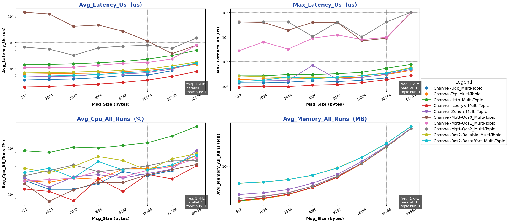

##### Impact of Topic Count in Multi-topic Mode:

- Test Purpose: Evaluate the performance of the single-machine cross-process Channel backend in multi-topic mode under different `topic counts`
- Test Configuration:
  - channel_frequency: 1 kHz
  - pkg_size: 1024 B
  - topic_number: 1 ~ 10
  - parallel_number=1
- Test Results:

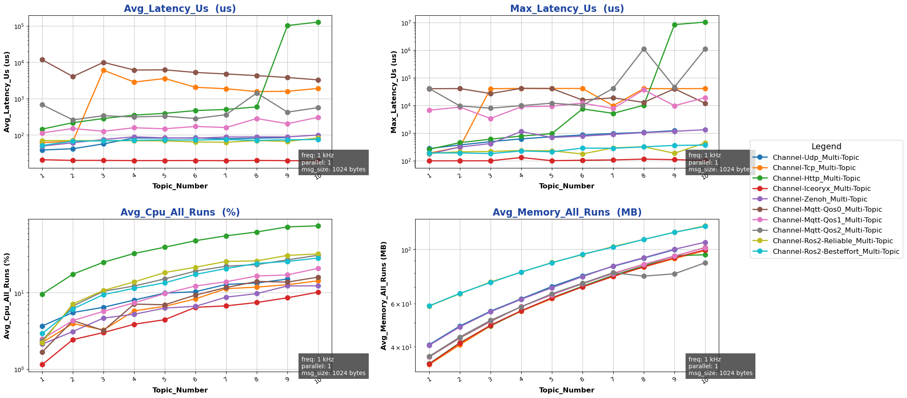

##### Impact of Packet Size in Parallel Mode:

- Test Purpose: Evaluate the performance of the single-machine cross-process Channel backend in parallel mode under different `packet sizes`
- Test Configuration:
  - channel_frequency: 1 kHz
  - pkg_size: 1024 B
  - topic_number: 1
  - parallel_number=1 ~ 10
- Test Results:

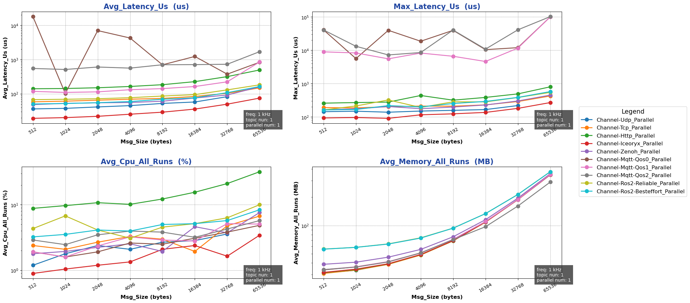

##### Impact of Concurrency in Parallel Mode:

- Test Purpose: Evaluate the performance of the single-machine cross-process Channel backend in parallel mode under different `concurrency levels`
- Test Configuration:
  - channel_frequency: 1 kHz
  - pkg_size: 1024 B
  - topic_number: 1
  - parallel_number=1 ~ 10
- Test Results:

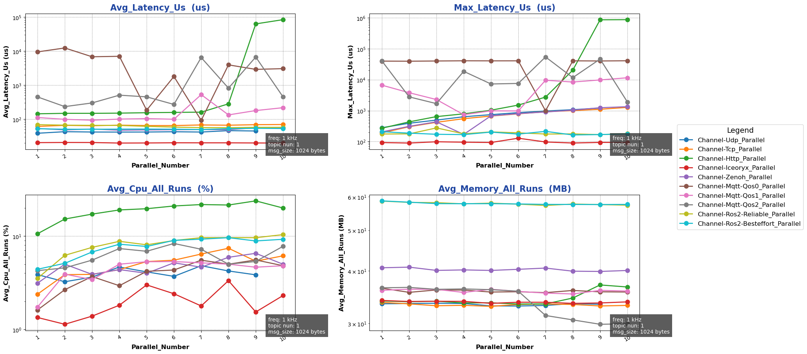

{{ '[Detailed Data]({}/document/sphinx-cn/tutorials/misc/performance_test/1.0.0/py/data/result_chnnel_local_py.csv)'.format(code_site_root_path_url) }}

#### Rpc Backend Performance Test

##### Impact of Packet Size in Bench Mode:

- Test Purpose: Evaluate the performance of the single-machine cross-process Rpc backend in bench mode under different `packet sizes`
- Test Configuration:
  - mode: bench
  - channel_frequency: 1 kHz
  - pkg_size: 256 B ~ 64 KB (2^8 ~ 2^16, increasing by powers of 2)
  - paraller_number: 1
- Test Results:

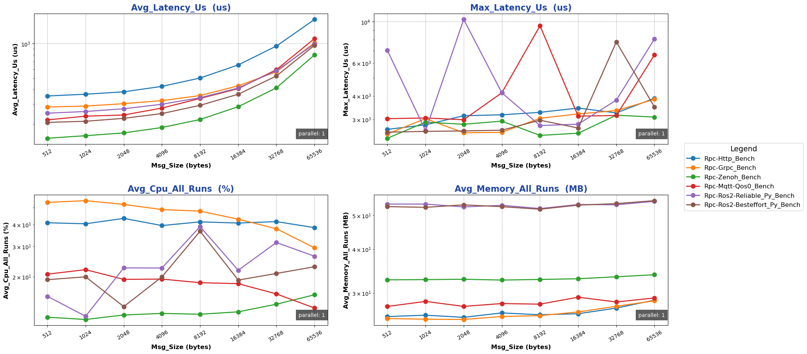

##### Impact of Concurrency in Bench Mode:

- Test Purpose: Evaluate the performance of the single-machine cross-process Rpc backend in bench mode under different `concurrency levels`
- Test Configuration:
  - mode: bench
  - channel_frequency: 1 kHz
  - pkg_size: 1024 B
  - paraller_number: 1 ~ 10
- Test Results:

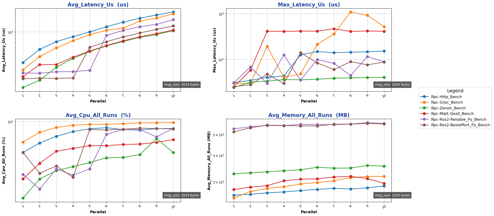

##### Impact of Packet Size in Fixed-freq Mode:

- Test Purpose: Evaluate the performance of the single-machine cross-process Rpc backend in fixed-freq mode under different `packet sizes`
- Test Configuration:
  - mode: fixed-freq
  - channel_frequency: 1 kHz
  - pkg_size: 256 B ~ 64 KB (2^8 ~ 2^16, increasing by powers of 2)
  - paraller_number: 1
- Test Results:

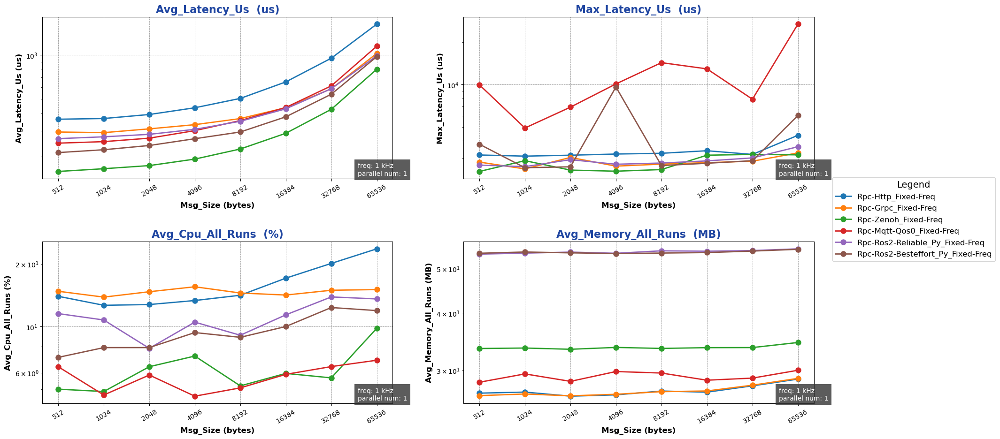

##### Impact of Concurrency in Fixed-freq Mode:

- Test Purpose: Evaluate the performance of the single-machine cross-process Rpc backend in fixed-freq mode under different `concurrency levels`
- Test Configuration:
  - mode: fixed-freq
  - channel_frequency: 1 kHz
  - pkg_size: 1024 B
  - paraller_number: 1 ~ 10
- Test Results:

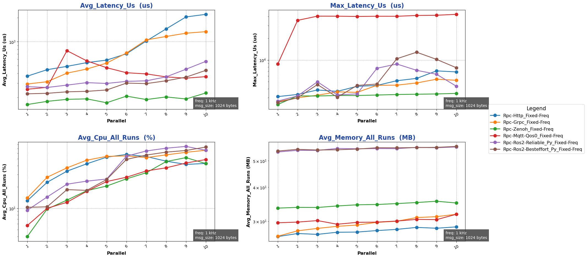

{{ '[Detailed Data]({}/document/sphinx-cn/tutorials/misc/performance_test/1.0.0/py/data/result_rpc_local_py.csv)'.format(code_site_root_path_url) }}

### Cross-machine Performance Test

#### Channel Backend Performance Test

##### Impact of Packet Size in Multi-topic Mode:

- Test Purpose: Evaluate the performance of the single-machine cross-process Channel backend in multi-topic mode under different `packet sizes`
- Test Configuration:
  - channel_frequency: 1 kHz
  - pkg_size: 256 B ~ 64 KB (2^8 ~ 2^16, increasing by powers of 2)
  - topic_number: 1
  - parallel_number=1
- Test Results:

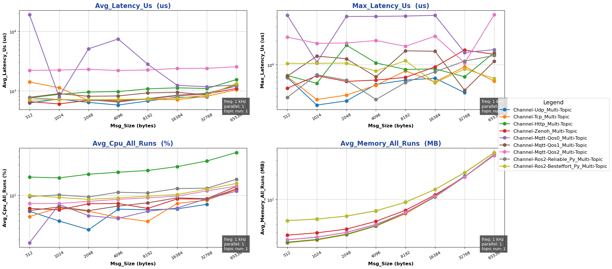

##### Impact of Topic Count in Multi-topic Mode:

- Test Purpose: Evaluate the performance of the single-machine cross-process Channel backend in multi-topic mode under different `topic counts`
- Test Configuration:
  - channel_frequency: 1 kHz
  - pkg_size: 1024 B
  - topic_number: 1 ~ 10
  - parallel_number=1
- Test Results:

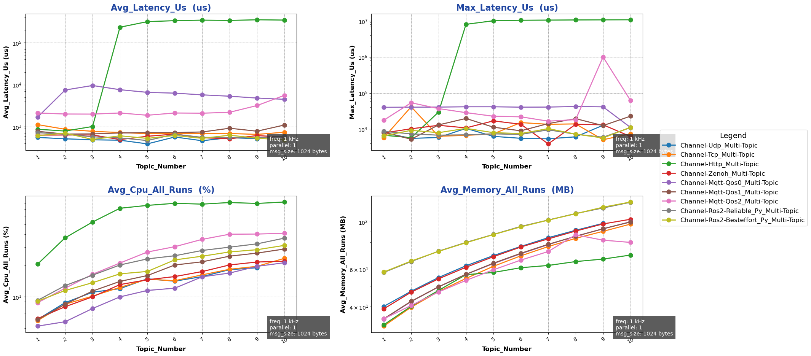

##### Impact of Packet Size in Parallel Mode:

- Test Purpose: Evaluate the performance of the single-machine cross-process Channel backend in parallel mode under different `packet sizes`
- Test Configuration:
  - channel_frequency: 1 kHz
  - pkg_size: 1024 B
  - topic_number: 1
  - parallel_number=1 ~ 10
- Test Results:

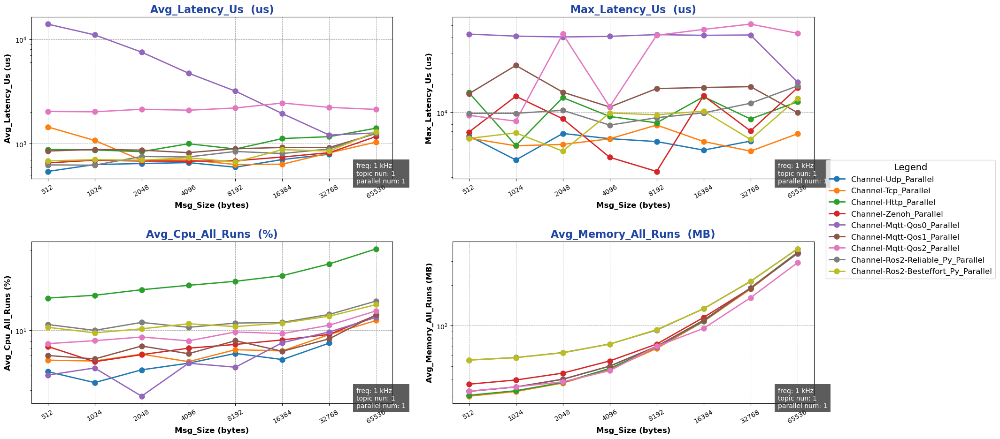

##### Impact of Concurrency in Parallel Mode:

- Test Purpose: Evaluate the performance of the single-machine cross-process Channel backend in parallel mode under different `concurrency levels`
- Test Configuration:
  - channel_frequency: 1 kHz
  - pkg_size: 1024 B
  - topic_number: 1
  - parallel_number=1 ~ 10
- Test Results:

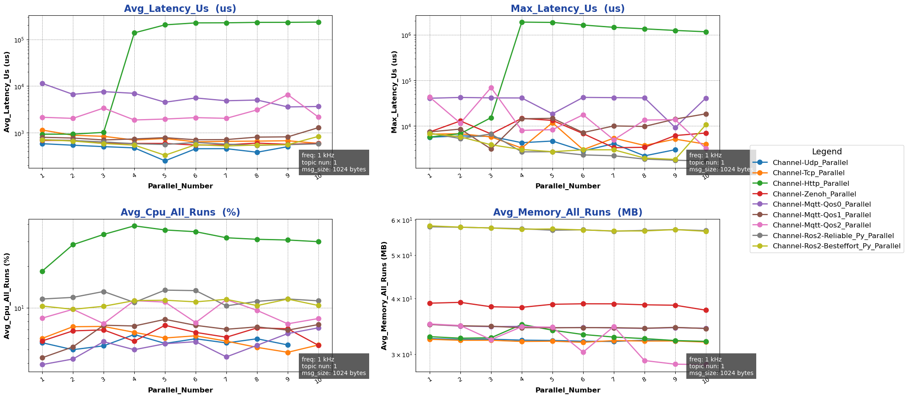

{{ '[Detailed Data]({}/document/sphinx-cn/tutorials/misc/performance_test/1.0.0/py/data/result_chnnel_cross_py.csv)'.format(code_site_root_path_url) }}

#### Rpc Backend Performance Test

##### Impact of Packet Size in Bench Mode:

- Test Purpose: Evaluate the performance of the single-machine cross-process Rpc backend in bench mode under different `packet sizes`
- Test Configuration:
  - mode: bench
  - channel_frequency: 1 kHz
  - pkg_size: 256 B ~ 64 KB (2^8 ~ 2^16, increasing by powers of 2)
  - paraller_number: 1
- Test Results:

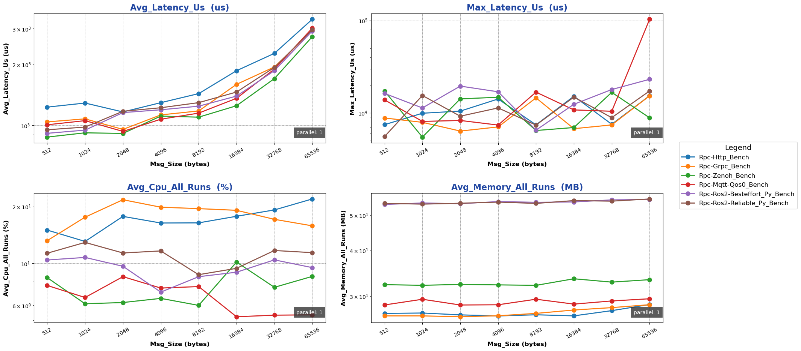

##### Impact of Concurrency in Bench Mode:

- Test Purpose: Evaluate the performance of the single-machine cross-process Rpc backend in bench mode under different `concurrency levels`
- Test Configuration:
  - mode: bench
  - channel_frequency: 1 kHz
  - pkg_size: 1024 B
  - paraller_number: 1 ~ 10
- Test Results:

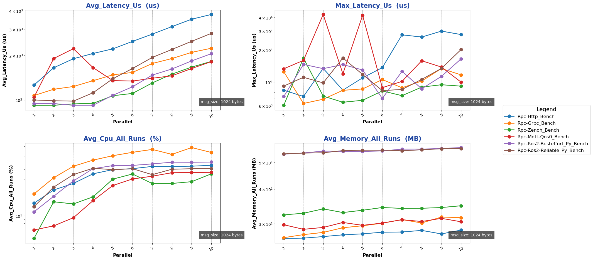

##### Impact of Packet Size in Fixed-freq Mode:

- Test Purpose: Evaluate the performance of the single-machine cross-process Rpc backend in fixed-freq mode under different `packet sizes`
- Test Configuration:
  - mode: fixed-freq
  - channel_frequency: 1 kHz
  - pkg_size: 256 B ~ 64 KB (2^8 ~ 2^16, increasing by powers of 2)
  - paraller_number: 1
- Test Results:

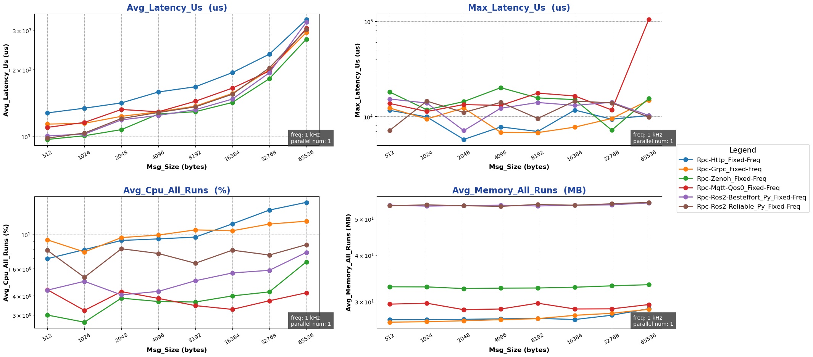

##### Impact of Concurrency in Fixed-freq Mode:

- Test Purpose: Evaluate the performance of the single-machine cross-process Rpc backend in fixed-freq mode under different `concurrency levels`
- Test Configuration:
  - mode: fixed-freq
  - channel_frequency: 1 kHz
  - pkg_size: 1024 B
  - paraller_number: 1 ~ 10
- Test Results:

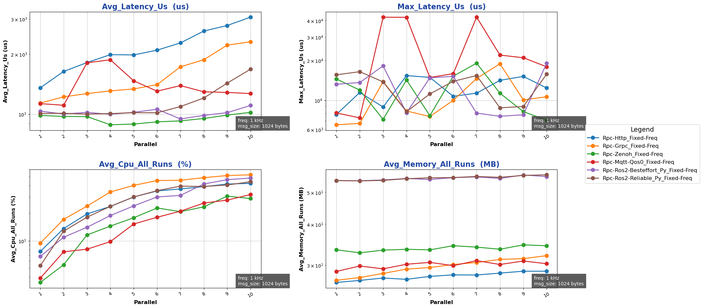

{{ '[Detailed Data]({}/document/sphinx-cn/tutorials/misc/performance_test/1.0.0/py/data/result_rpc_cross_py.csv)'.format(code_site_root_path_url) }}