<table style="width: 100%; color: gray; font-size: 14px;">
<tr>
<td style="text-align: left;">NOTE: following tests were done in Feb. 2026, which may not reflect latest status of the package.</td>
</tr>
</table>

# AimRT 1.6.0-cpp &nbsp;Performance Test Report

## Preface

AimRT's communication layer is implemented via plugins. Officially supported backends include Iceoryx, ROS2, Zenoh, Net, Grpc, Mqtt, etc., covering common edge and cloud communication scenarios. These plugins provide `publish-subscribe (Channel)` and `request-response (Rpc)` communication patterns to enable multi-process communication both `locally` and `across machines`.

## Test Environment

- System Environment:

  - OS: 6.1.59-rt16 x86_64 GNU/Linux
  - CPU: 13th Gen Intel(R) Core(TM) i5-1350P
  - Total / Available Memory: 62Gi / 38Gi

- Software Environment:
  - AimRT Version: 1.6.0

## Test Items

Tests were conducted using AimRT-cpp. The test items are as follows:

- Single-machine performance tests
  - Channel backend performance tests
    - Effect of packet size in multi-topic mode
    - Effect of topic count in multi-topic mode
    - Effect of packet size in parallel mode
    - Effect of concurrency in parallel mode
  - Rpc backend performance tests
    - Effect of packet size in bench mode
    - Effect of concurrency in bench mode
    - Effect of packet size in fixed_freq mode
    - Effect of concurrency in fixed_freq mode
- Multi-machine performance tests
  - Channel backend performance tests
    - Effect of packet size in multi-topic mode
    - Effect of topic count in multi-topic mode
    - Effect of packet size in parallel mode
    - Effect of concurrency in parallel mode
  - Rpc backend performance tests
    - Effect of packet size in bench mode
    - Effect of concurrency in bench mode
    - Effect of packet size in fixed_freq mode
    - Effect of concurrency in fixed_freq mode

## Test Results

### Single-machine Performance Test (X86)

#### Channel Backend Performance Tests

##### Effect of Packet Size in Multi-topic Mode:

- Purpose: Evaluate single-machine cross-process Channel backend performance under different `packet sizes` in multi-topic mode
- Configuration:
  - channel_frequency: 1 kHz
  - pkg_size: 256 B ~ 64 KB (2^8 ~ 2^16, increasing by powers of 2)
  - topic_number: 1
  - parallel_number=1
- Results:

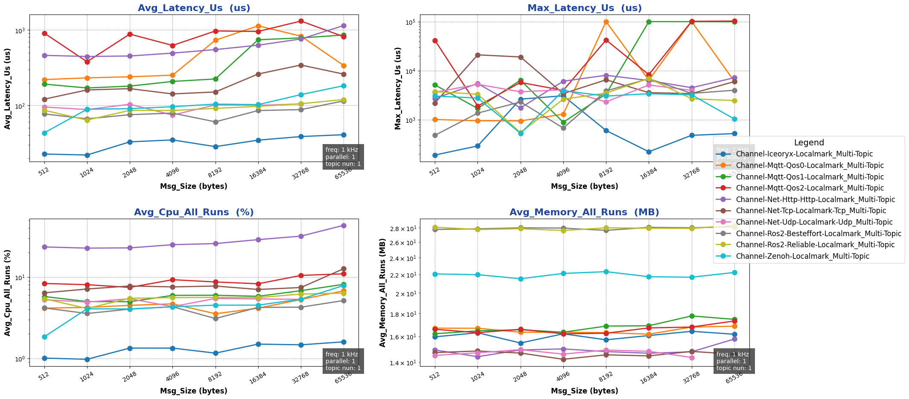

##### Effect of Topic Count in Multi-topic Mode:

- Purpose: Evaluate single-machine cross-process Channel backend performance under different `topic counts` in multi-topic mode
- Configuration:
  - channel_frequency: 1 kHz
  - pkg_size: 1024 B
  - topic_number: 1 ~ 10
  - parallel_number=1
- Results:

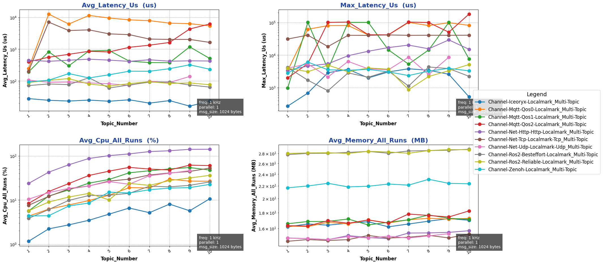

##### Effect of Packet Size in Parallel Mode:

- Purpose: Evaluate single-machine cross-process Channel backend performance under different `packet sizes` in parallel mode
- Configuration:
  - channel_frequency: 1 kHz
  - pkg_size: 1024 B
  - topic_number: 1
  - parallel_number=1 ~ 10
- Results:

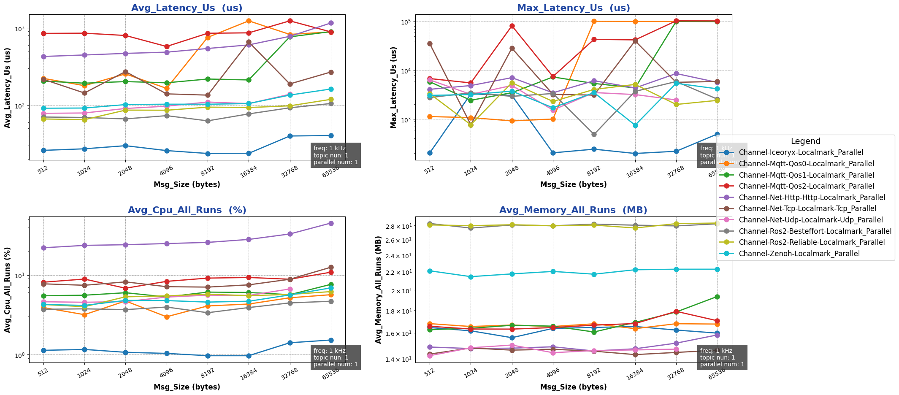

##### Effect of Concurrency in Parallel Mode:

- Purpose: Evaluate single-machine cross-process Channel backend performance under different `concurrency levels` in parallel mode
- Configuration:
  - channel_frequency: 1 kHz
  - pkg_size: 1024 B
  - topic_number: 1
  - parallel_number=1 ~ 10
- Results:

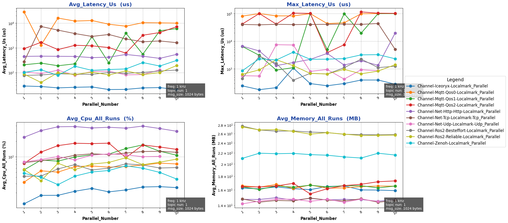

{{ '[Detailed Data]({}/document/sphinx-cn/tutorials/misc/performance_test/1.0.0/cpp/data/result_channel_local_cpp.csv)'.format(code_site_root_path_url) }}

#### Rpc Backend Performance Tests

##### Effect of Packet Size in Bench Mode:

- Purpose: Evaluate single-machine cross-process Rpc backend performance under different `packet sizes` in bench mode
- Configuration:
  - mode: bench
  - channel_frequency: 1 kHz
  - pkg_size: 256 B ~ 64 KB (2^8 ~ 2^16, increasing by powers of 2)
  - paraller_number: 1
- Results:

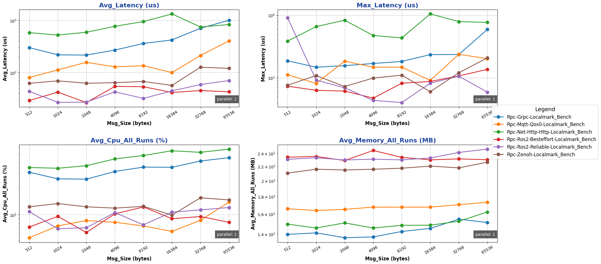

##### Effect of Concurrency in Bench Mode:

- Purpose: Evaluate single-machine cross-process Rpc backend performance under different `concurrency levels` in bench mode
- Configuration:
  - mode: bench
  - channel_frequency: 1 kHz
  - pkg_size: 1024 B
  - paraller_number: 1 ~ 10
- Results:

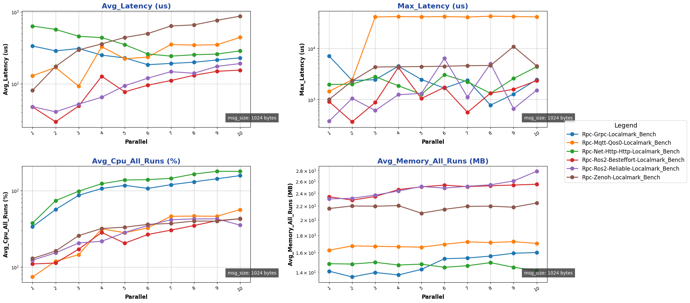

##### Effect of Packet Size in Fixed-freq Mode:

- Purpose: Evaluate single-machine cross-process Rpc backend performance under different `packet sizes` in fixed-freq mode
- Configuration:
  - mode: fixed-freq
  - channel_frequency: 1 kHz
  - pkg_size: 256 B ~ 64 KB (2^8 ~ 2^16, increasing by powers of 2)
  - paraller_number: 1
- Results:

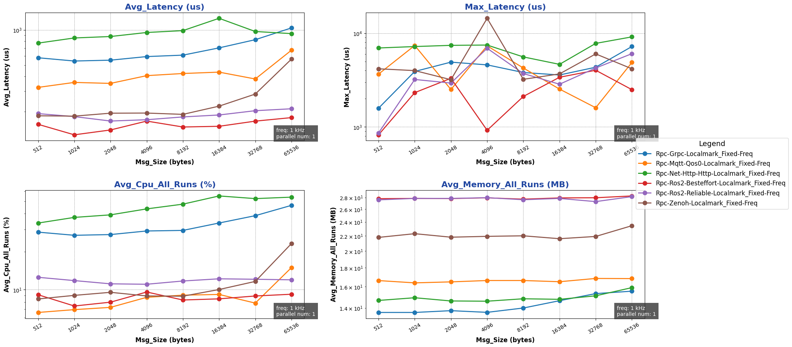

##### Effect of Concurrency in Fixed-freq Mode:

- Purpose: Evaluate single-machine cross-process Rpc backend performance under different `concurrency levels` in fixed-freq mode
- Configuration:
  - mode: fixed-freq
  - channel_frequency: 1 kHz
  - pkg_size: 1024 B
  - paraller_number: 1 ~ 10
- Results:

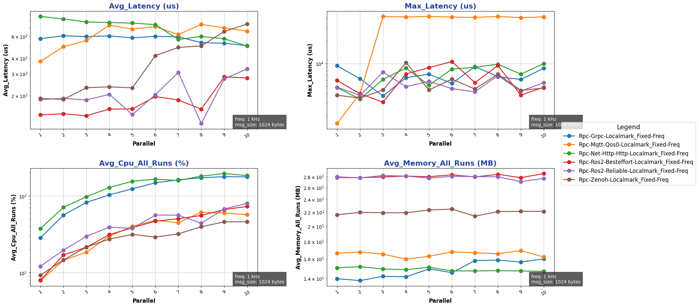

{{ '[Detailed Data]({}/document/sphinx-cn/tutorials/misc/performance_test/1.0.0/cpp/data/result_rpc_local_cpp.csv)'.format(code_site_root_path_url) }}

### Cross-machine Performance Tests

#### Channel Backend Performance Tests

##### Effect of Packet Size in Multi-topic Mode:

- Purpose: Evaluate single-machine cross-process Channel backend performance under different `packet sizes` in multi-topic mode
- Configuration:
  - channel_frequency: 1 kHz
  - pkg_size: 256 B ~ 64 KB (2^8 ~ 2^16, increasing by powers of 2)
  - topic_number: 1
  - parallel_number=1
- Results:

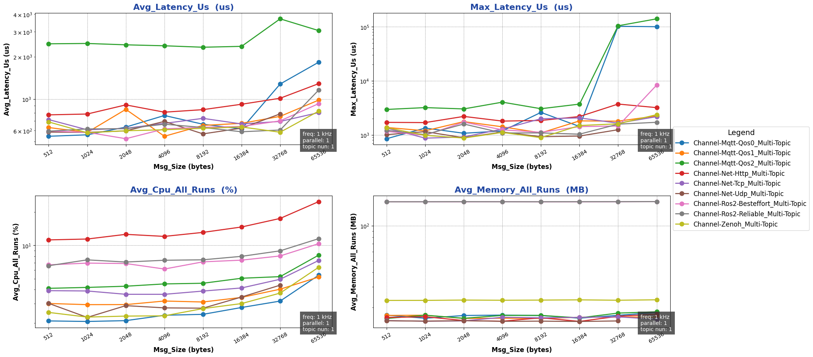

##### Effect of Topic Count in Multi-topic Mode:

- Purpose: Evaluate single-machine cross-process Channel backend performance under different `topic counts` in multi-topic mode
- Configuration:
  - channel_frequency: 1 kHz
  - pkg_size: 1024 B
  - topic_number: 1 ~ 10
  - parallel_number=1
- Results:

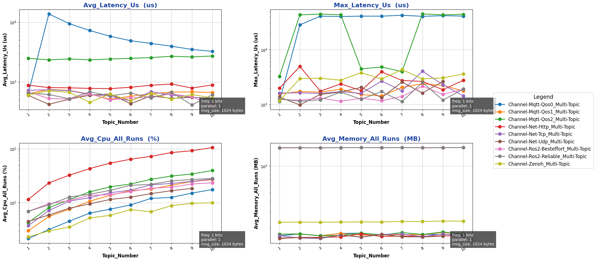

##### Effect of Packet Size in Parallel Mode:

- Purpose: Evaluate single-machine cross-process Channel backend performance under different `packet sizes` in parallel mode
- Configuration:
  - channel_frequency: 1 kHz
  - pkg_size: 1024 B
  - topic_number: 1
  - parallel_number=1 ~ 10
- Results:

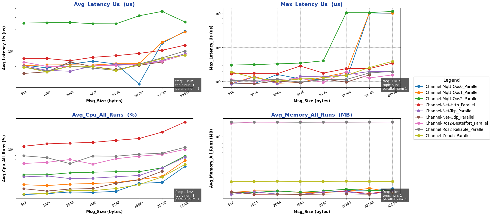

##### Effect of Concurrency in Parallel Mode:

- Purpose: Evaluate single-machine cross-process Channel backend performance under different `concurrency levels` in parallel mode
- Configuration:
  - channel_frequency: 1 kHz
  - pkg_size: 1024 B
  - topic_number: 1
  - parallel_number=1 ~ 10
- Results:

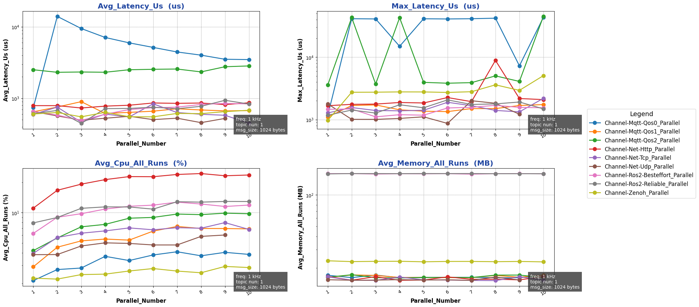

{{ '[Detailed Data]({}/document/sphinx-cn/tutorials/misc/performance_test/1.0.0/cpp/data/result_channel_cross_cpp.csv)'.format(code_site_root_path_url) }}

#### Rpc Backend Performance Tests

##### Effect of Packet Size in Bench Mode:

- Purpose: Evaluate single-machine cross-process Rpc backend performance under different `packet sizes` in bench mode
- Configuration:
  - mode: bench
  - channel_frequency: 1 kHz
  - pkg_size: 256 B ~ 64 KB (2^8 ~ 2^16, increasing by powers of 2)
  - paraller_number: 1
- Results:

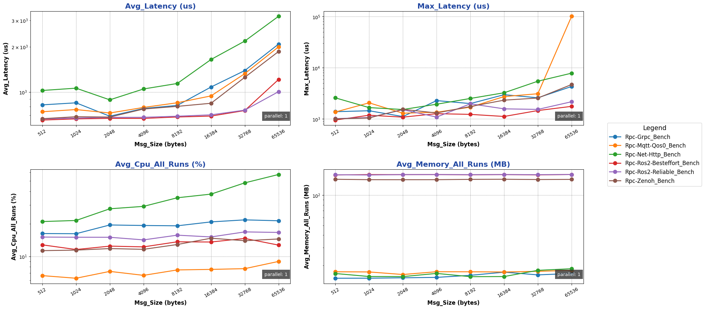

##### Effect of Concurrency in Bench Mode:

- Purpose: Evaluate single-machine cross-process Rpc backend performance under different `concurrency levels` in bench mode
- Configuration:
  - mode: bench
  - channel_frequency: 1 kHz
  - pkg_size: 1024 B
  - paraller_number: 1 ~ 10
- Results:

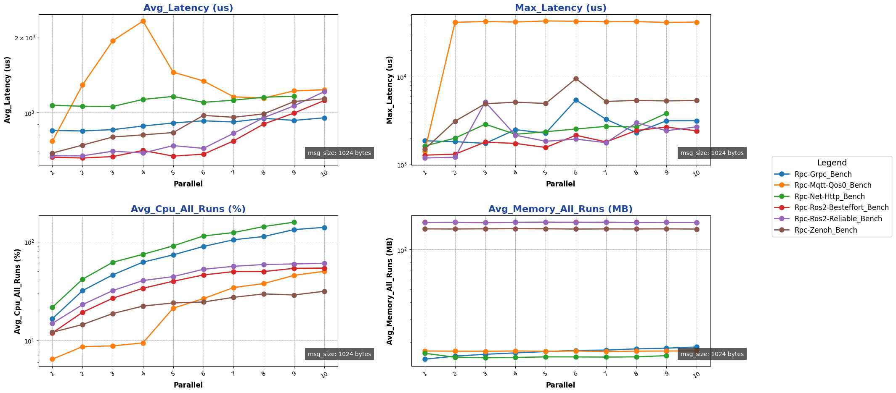

##### Effect of Packet Size in Fixed-freq Mode:

- Purpose: Evaluate single-machine cross-process Rpc backend performance under different `packet sizes` in fixed-freq mode
- Configuration:
  - mode: fixed-freq
  - channel_frequency: 1 kHz
  - pkg_size: 256 B ~ 64 KB (2^8 ~ 2^16, increasing by powers of 2)
  - paraller_number: 1
- Results:

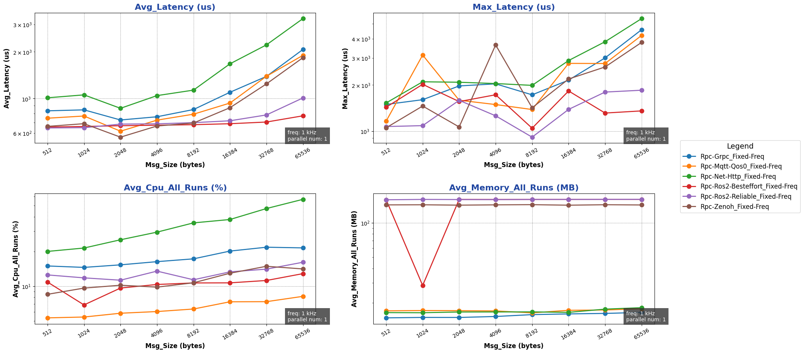

##### Effect of Concurrency in Fixed-freq Mode:

- Purpose: Evaluate single-machine cross-process Rpc backend performance under different `concurrency levels` in fixed-freq mode
- Configuration:
  - mode: fixed-freq
  - channel_frequency: 1 kHz
  - pkg_size: 1024 B
  - paraller_number: 1 ~ 10
- Results:

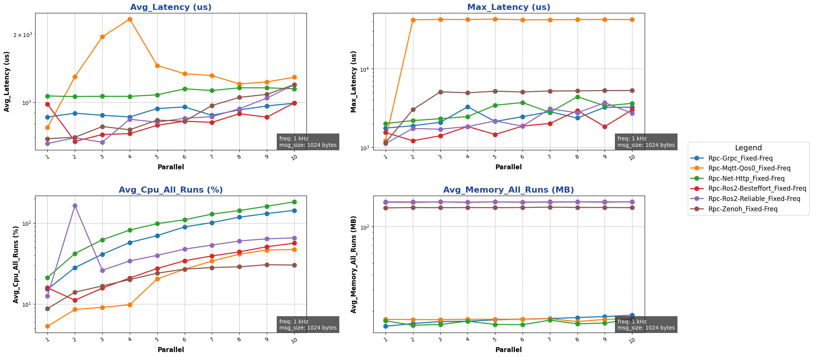

{{ '[Detailed Data]({}/document/sphinx-cn/tutorials/misc/performance_test/1.0.0/cpp/data/result_rpc_cross_cpp.csv)'.format(code_site_root_path_url) }}
